# Blockchain & Solidity Lab1 – Crowdfunding dApp Development

### S2BC

<div style="text-align: center;">
  
</div>

---

### Lab 1: Developing Ethereum Smart Contracts

- **BUILD** / TEST / INTEGRATE / RUN

---

### This Hands on Module will build up of 4 Labs:

1. Developing Ethereum Smart Contracts [**BUILD**]

2. Test Ethereum Smart Contracts [TEST]

3. Integrate Smart Contracts with Web3 and establish and run your 1st dApp [INTEGRATE]

4. Run a dApp and considering next steps to create a possible contribution [RUN]

---

## Prerequisites

To make the most out of this lab, a basic understanding of programming concepts and familiarity with JavaScript will be beneficial. However, even if you're new to blockchain development, we'll guide you through each step.

Let's dive in and get started with the first part of our journey: Developing Ethereum Smart Contracts!

---

## dApp folder structure Overview

<div style="text-align: center;">
  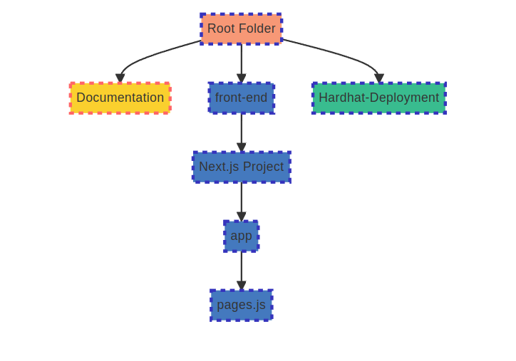
</div>

## Flow overview

<div style="text-align: center;">
  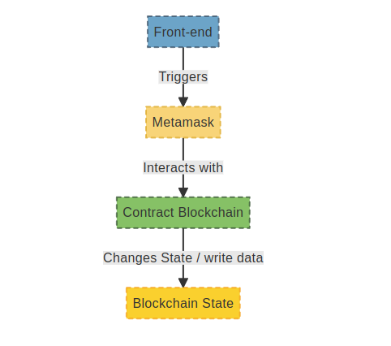
</div>

<div style="text-align: center;">
  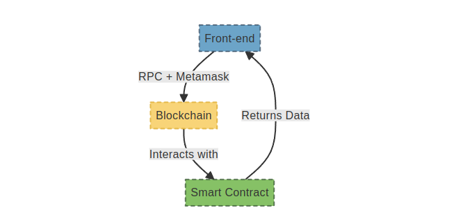
</div>

---

## Overview contract CampaignCreator.sol

### Diagram of interactions

<div style="text-align: center;">
  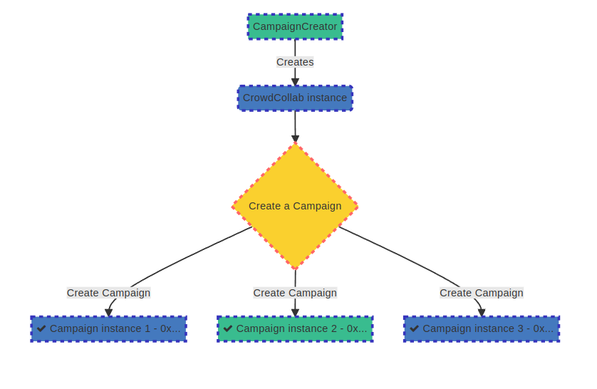
</div>

## Overview contract CrowdCollab.sol

### Diagram of interactions

<div style="text-align: center;">
  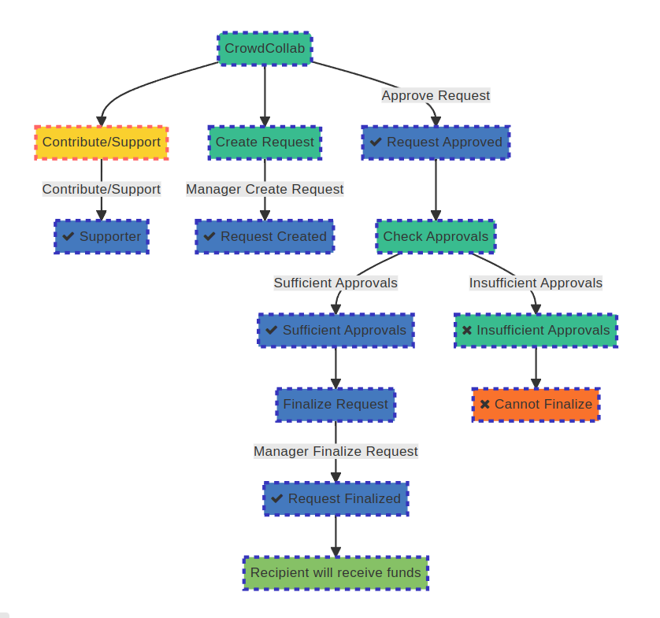
</div>

## DEVELOPING ETHEREUM SMART CONTRACTS

We'll kick off this development journey with a smart contract designed to address issues commonly encountered in traditional centralized crowdfunding platforms.

### What's the Problem?

Traditional centralized crowdfunding platforms often lack transparency and may expose backers to various risks, including mismanagement of funds or failure to deliver on promises.

### What's the Solution?

By leveraging blockchain technology and smart contracts, we can create a decentralized crowdfunding solution that provides transparency, security, and community involvement. This approach empowers backers to directly participate in project funding decisions, fostering trust and accountability in the crowdfunding process.

### How will it work?

- **Campaign Manager Role:** A campaign manager has the authority to initiate a crowdfunding campaign by specifying the minimum contribution, campaign description, and managing campaign requests.

- **Supporter Participation:** Supporters can contribute funds to the campaign, which are then used to fulfill project requests.

- **Request Creation:** The campaign manager can create funding requests, specifying the description, required amount, and recipient address for each request.

- **Request Approval:** Supporters have the ability to approve funding requests, ensuring transparency and community involvement in the allocation of funds.

- **Request Finalization:** Once a funding request receives sufficient approvals, the campaign manager can finalize it, transferring the requested amount to the designated recipient.# Blockchain & Solidity Lab1 – Crowdfunding dApp Development

### S2BC

<div style="text-align: center;">
  
</div>

---

## DEVELOPING ETHEREUM SMART CONTRACTS

We'll kick off this development journey with a smart contract designed to address issues commonly encountered in traditional centralized crowdfunding platforms.

### What's the Problem?

Traditional centralized crowdfunding platforms often lack transparency and may expose backers to various risks, including mismanagement of funds or failure to deliver on promises.

### What's the Solution?

By leveraging blockchain technology and smart contracts, we can create a decentralized crowdfunding solution that provides transparency, security, and community involvement. This approach empowers backers to directly participate in project funding decisions, fostering trust and accountability in the crowdfunding process.

### How will it work?

- **Campaign Manager Role:** A campaign manager has the authority to initiate a crowdfunding campaign by specifying the minimum contribution, campaign description, and managing campaign requests.

- **Supporter Participation:** Supporters can contribute funds to the campaign, which are then used to fulfill project requests.

- **Request Creation:** The campaign manager can create funding requests, specifying the description, required amount, and recipient address for each request.

- **Request Approval:** Supporters have the ability to approve funding requests, ensuring transparency and community involvement in the allocation of funds.

- **Request Finalization:** Once a funding request receives sufficient approvals, the campaign manager can finalize it, transferring the requested amount to the designated recipient.

- **Campaign Summary:** Supporters can view a summary of the campaign, including the minimum contribution required, total funds raised, number of requests, number of supporters, and the address of the campaign manager.

- **Transparency and Security:** The use of smart contracts ensures transparency and security throughout the crowdfunding process, as all transactions are recorded on the blockchain.

### ELEMENTS OF THE APP

#### Variables:

- `manager`: Address of the campaign manager.
- `minimumContribution`: Minimum amount required to participate in the campaign (in ETH).
- `campaignDescription`: Description of the crowdfunding campaign.
- `supporters`: Mapping of supporter addresses to their participation status.
- `numberSupporters`: Total number of supporters participating in the campaign.
- `requests`: Array holding funding request details, including description, amount, recipient, completion status, and list of approvals.

#### Functions:

- `managerOnly`: Modifier restricting certain functions to be executed only by the campaign manager.
- `supporterOnly`: Modifier ensuring that certain functions can only be called by supporters.
- `contribute()`: Function for supporters to contribute funds to the campaign.
- `support()`: Function alias for contributing to the campaign.
- `createRequest(_description, _amount, _recipient)`: Function for the manager to create a funding request.
- `approveRequest(_requestId)`: Function for supporters to approve a funding request.
- `finalizeRequest(_requestId)`: Function for the manager to finalize a funding request after receiving sufficient approvals.
- `getSummary()`: Function to retrieve a summary of the campaign.
- `getRequestsCount()`: Function to get the total number of funding requests in the campaign.
- `isApproved(_request, _approver)`: Internal function to check if a supporter has already approved a request.

---

### A BRIEF INTRODUCTION TO SOME PROGRAMMING BASICS (SKIP, IF YOU HAVE SOME CODING EXPERIENCE)

#### Introduction to Command Line

Chances are, you're working on a computer powered by a Linux, Mac, or Windows Operating System. Mastering the command line is pivotal for the tasks ahead. While you may write your code in editors like Microsoft Visual Studio Code or use Remix for Solidity smart contracts, the command line is indispensable for executing and testing your programs, even on the Morpheus Labs Platform. It's a versatile tool, with one of its primary roles being to leverage the npm package manager for installing necessary packages.

If you're using Windows, you might want to consider using Ubuntu Linux on Windows Subsystem for Linux (WSL) for a smoother experience. WSL provides a Linux environment within your Windows system, greatly benefiting blockchain development.

- **For Linux**: Open the terminal. (Shortcut: CTRL+ALT+T)

- **For Windows (with Ubuntu on WSL)**: Launch the WSL terminal.

- **For Mac**: Utilize the terminal.

- **On Morpheus Labs SEED BPaaS**: Access the terminal. (Ubuntu docker)

#### Navigating your file system

When navigating your file system, keep these commands in mind:

- `cd ..`: Move up one directory level.
- `cd <folder name>`: Enter a specific folder.
- `ls`: List files and folders in the current directory.
- `ls -a`: List all files and folders, including hidden ones.
- `cat <file name>`: Display the contents of a file.
- `touch <file name>`: Create a new file.
- `mkdir <folder name>`: Create a new folder.
- `rm <file name>`: Remove a file (be cautious, this action is irreversible).
- `rm -r <folder name>`: Remove a folder and its contents.
- `mv <source> <destination>`: Move or rename files and folders.
- `cp <source> <destination>`: Copy files or folders.
- `pwd`: Display the current working directory.
- `clear`: Clear the terminal screen.
- `history`: Display a list of recently used commands.
- `grep <pattern> <file>`: Search for a specific pattern in a file.
- `chmod <permissions> <file>`: Change the permissions of a file.
- `nano <file name>`: Open the Nano text editor to edit a file.
- `wget <URL>`: Download a file from the internet.
- `curl <URL>`: Transfer data from or to a server.

Once you're in the desired folder, you can run your program by typing `<program name>` in the command line. NPM, a potent package manager, will be your go-to tool for installing, updating, and removing packages like Hardhat, ethers, Express...

#### Introduction to Basic Programming Concepts

##### Variables and Constants

In programming, variables and constants are essential components. They are used to store and manipulate data.

- **Variables**: These are containers that can hold various types of data, such as strings, integers, or booleans (true/false). The value of a variable can be changed during the execution of a program.

  ```javascript
  let name = "John"; // Here, 'name' is a variable storing a string value "John".
  let age = 30; // 'age' is a variable storing an integer value 30.
  let isStudent = true; // 'isStudent' is a variable storing a boolean value true.
  ```

- **Constants**: Unlike variables, constants hold fixed values that do not change during the execution of a program.

  ```javascript
  const PI = 3.14; // Here, 'PI' is a constant with a fixed value of 3.14.
  const MAX_SIZE = 100; // 'MAX_SIZE' is a constant with a fixed value of 100.
  ```

##### Data Structures

Understanding data structures is crucial for efficient data management in programming. Here are some common data structures:

- **Array**: An array is defined within square brackets `[]`. It can hold multiple values, each separated by commas.

  ```javascript
  let numbers = [1, 2, 3, 4, 5]; // 'numbers' is an array containing five integers.
  let names = ["Alice", "Bob", "Charlie"]; // 'names' is an array containing three strings.
  ```

- **Object (Dictionary)**: An object is defined within curly braces `{}`. It consists of key-value pairs, where each piece of data is mapped to a specific value.

  ```javascript
  let person = {
    name: "John",
    age: 30,
    isStudent: false,
  }; // 'person' is an object with name, age, and isStudent as keys and their respective values.
  ```

##### Functions

Functions play a vital role in programming. They take input values, process them, and return a result. Functions are defined with a name, input parameters within parentheses `()`, and the code to be executed within curly braces `{}`.

They can be called by using the function name and providing the necessary input values.

```javascript
function addNumbers(num1, num2) {
  return num1 + num2;
}

let result = addNumbers(5, 3); // 'result' will be 8.
```

##### Classes

Classes are fundamental to object-oriented programming (OOP). They encapsulate data and functions into a single unit. A class can contain multiple functions that define the behavior of objects created from that class.

## To Set Up the Development Environment MORPHEUSLABS BPAAS SEED

### Configure repository :

- https://docs.morpheuslabs.io/docs/configuration

### Create workspace morpheus doc page :

- https://docs.morpheuslabs.io/docs/configure-a-workspace#section-create-a-workspace

### Obtain or Create a private blockchain network POA:

- https://docs.morpheuslabs.io/docs/blockchain-networks

For development purposes, use the Ethereum POA Consortium with ChainID 1303 and currency ETH, which can be easily created within the Morpheus Seed environment.

- **votinchain** ChainID 1303 Currency ETH

- click on this info icon to get to the VSCode interface of morpheus by retrieving the workspace url.

<div style="text-align: center;">
  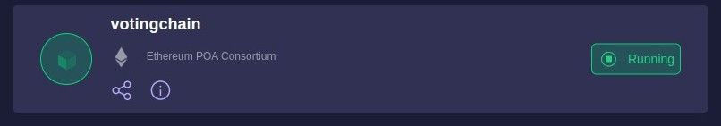
</div>

<div style="text-align: center;">
  
</div>

<div style="text-align: center;">
  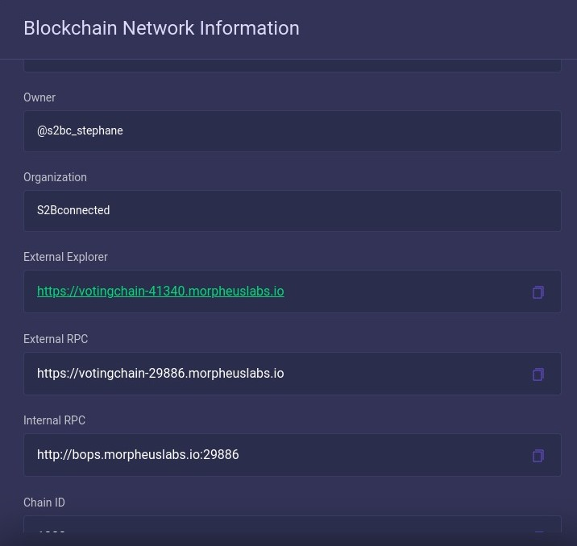
</div>
Then click on retrive:

<div style="text-align: center;">
  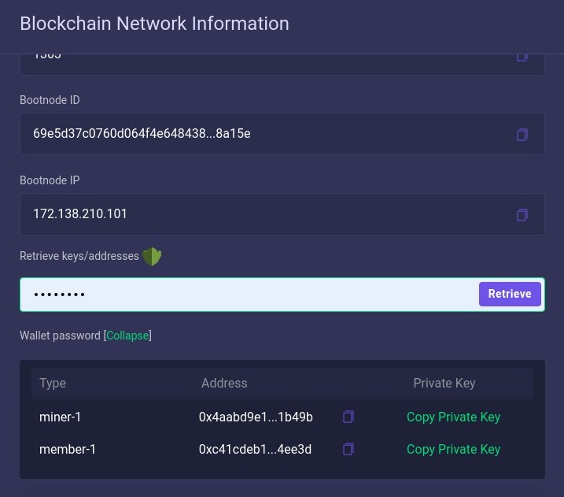
</div>

You can find your private here:

<div style="text-align: center;">
  
</div>

Keep this informations at hand for the next configuration of Metamask.

##### Notes for later:

Then, into **Lab4**, at final stage of the development we will migrate to the **Sepolia** network with ChainID **11155111** (0xaa36a7) and currency ETH. This setup will simulate the Ethereum mainnet for testing purposes.

To accomplish this, you need to modify the ChainID value in both the frontend script and the .env file within the Hardhat configuration. Additionally, update the hardhat.config.js file to include the new ChainID, as well as adjust the RPC URL and the private key associated with the deployer account into .env file.

- **Sepolia** ChainID 11155111(0xaa36a7) Currency ETH

The same process would be applied if you wanted to deploy the **Ethereum** ETH **mainnet**.

### Configure your Metamask:

- Add custum network to metamask
<div style="text-align: center;">
  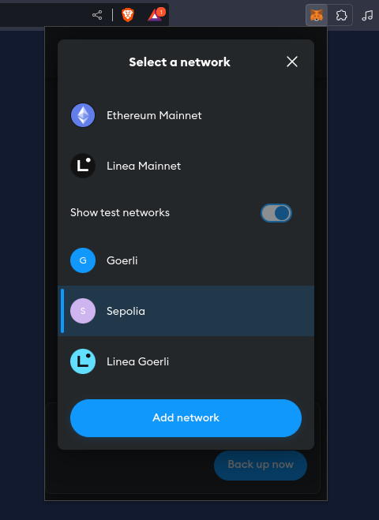
</div>
<div style="text-align: center;">
  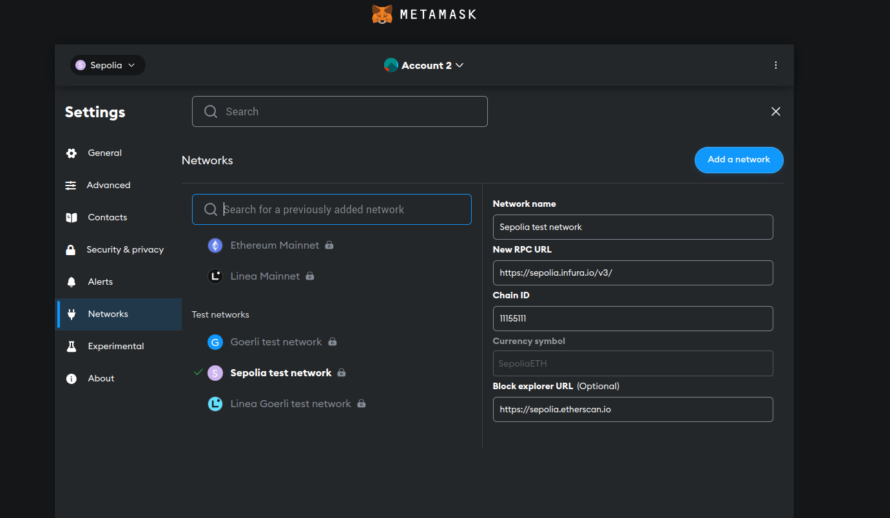
</div>

<div style="text-align: center;">
  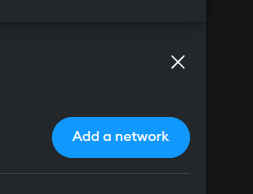
</div>

<div style="text-align: center;">
  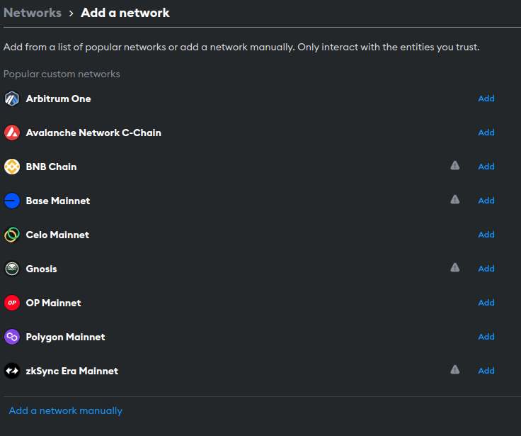
</div>

<div style="text-align: center;">
  
</div>

- Add your Network infos:

<div style="text-align: center;">
  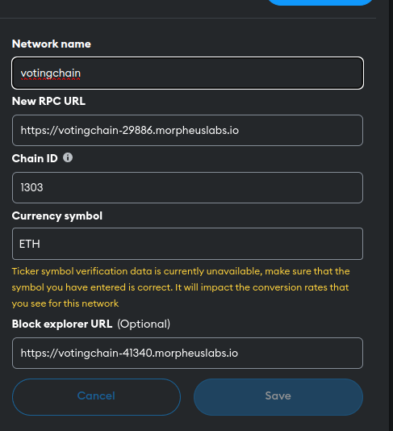
</div>

- Import account into metamask

Use the private key of the member accout to import your inccount into metamask:

<div style="text-align: center;">
  
</div>

Metamask -> accounts -> import account -> past private key

<div style="text-align: center;">
  
</div>

<div style="text-align: center;">
  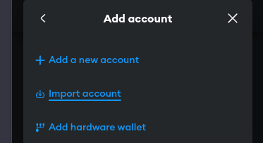
</div>

<div style="text-align: center;">
  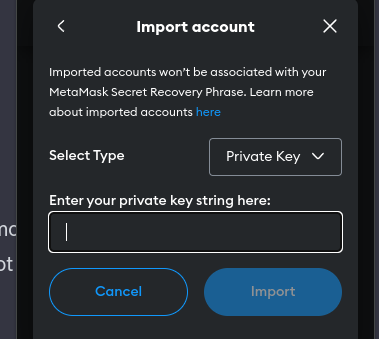
</div>

Then we have our Metamask ready to connect to the new network, click on change network and select the newly created custum network "votingchain"

<div style="text-align: center;">
  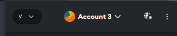
</div>

<div style="text-align: center;">
  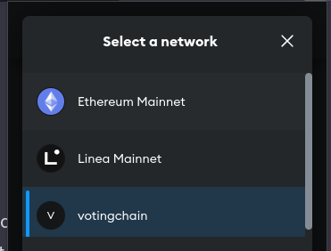
</div>

Link to the official Metamask documentation: https://docs.metamask.io/

- [Metamask Documentation](https://docs.metamask.io/)

## Launch Workspace IDE (vscode)

- click on this info icon to get to the VSCode interface of morpheus by retrieving the workspace url.

<div style="text-align: center;">
  
</div>

into this

<div style="text-align: center;">
  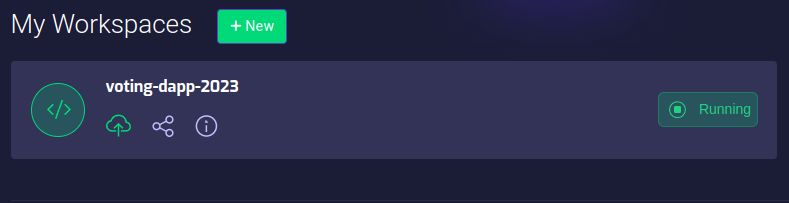
</div>
You will get to the Workspace information board:

<div style="text-align: center;">
  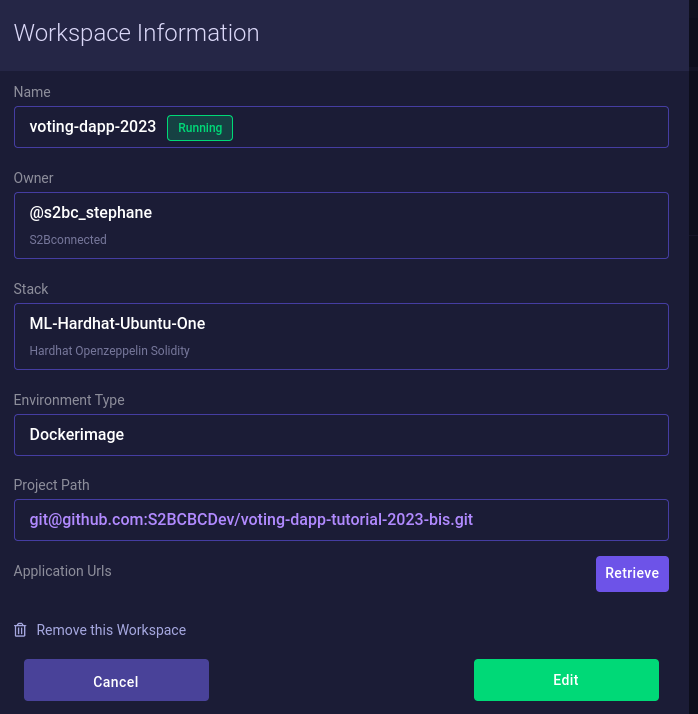
</div>
Click on "Retrive" button:
<div style="text-align: center;">
  
</div>
It should transform into:
<div style="text-align: center;">
  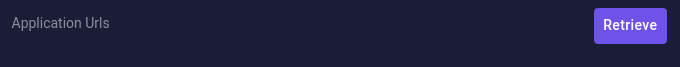
</div>

<div style="text-align: center;">
  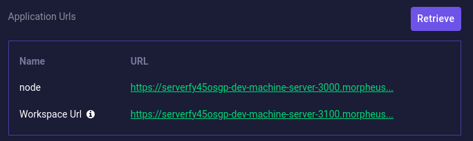
</div>
Click on Workspace Url to get to your IDE:
<div style="text-align: center;">
  
</div>
You should have your IDE open now:
<div style="text-align: center;">
  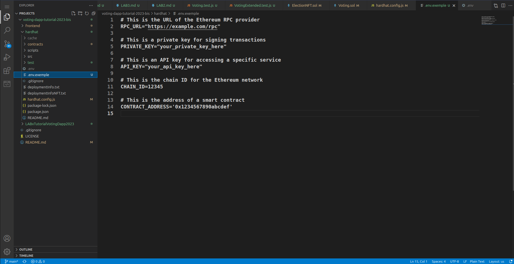
</div>
Go to your left menu and find for new Terminal:
<div style="text-align: center;">
  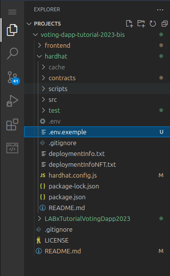
</div>

<div style="text-align: center;">
  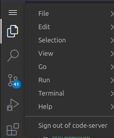
</div>

<div style="text-align: center;">
  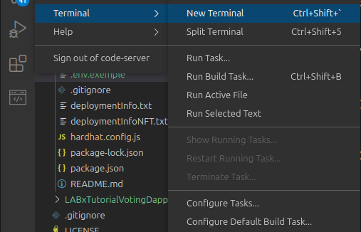
</div>
Check what is in your project and then change directory to your app or go next step by setting up your main directory:
<div style="text-align: center;">
  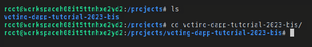
</div>

## Set up the main dapp repository

To get started with our decentralized crowdfunding application tutorial, we'll first set up the main repository. Follow these steps:

### Step 1: Create a Folder

Open a terminal and execute the following commands to create a new folder for our project:

```bash
mkdir crowdfunding-dapp-tutorial
cd crowdfunding-dapp-tutorial
touch README.md
git init
git add .
git commit -m "Initial commit"
```

This will create a new directory named `crowdfunding-dapp-tutorial` and a `README.md` file, which will serve as the main documentation for our project. Additionaly this will initialise Git for our project.

### Step 2: Install HardHat

Next, we'll install HardHat, a popular development environment for Ethereum. HardHat provides a set of tools that make it easy to compile, deploy, and test smart contracts. Execute the following command to install HardHat:

```bash
mkdir hardhat    // this will create a hardhat folder
cd hardhat       // this will make you move into hardhat folder
npx hardhat init // this will initialise hardhat and create a folder structure
```

This command will fetch and set up the HardHat environment in our project directory.

In the dialogue box of hardhat:

- Create a JavaScript project - YES
- Confirm root folder location - ENTER
- Add gitignore - YES
- install dependencies with npm (hardhat @nomicfoundation/hardhat-toolbox)- YES

#### Verify HardHat installation

```
npx hardhat --version
```

With these initial steps completed, we're now ready to proceed with the creation of our sma

- **Campaign Summary:** Supporters can view a summary of the campaign, including the minimum contribution required, total funds raised, number of requests, number of supporters, and the address of the campaign manager.

- **Transparency and Security:** The use of smart contracts ensures transparency and security throughout the crowdfunding process, as all transactions are recorded on the blockchain.

### ELEMENTS OF THE APP

#### Variables:

- `manager`: Address of the campaign manager.
- `minimumContribution`: Minimum amount required to participate in the campaign (in ETH).
- `campaignDescription`: Description of the crowdfunding campaign.
- `supporters`: Mapping of supporter addresses to their participation status.
- `numberSupporters`: Total number of supporters participating in the campaign.
- `requests`: Array holding funding request details, including description, amount, recipient, completion status, and list of approvals.

#### Functions:

- `managerOnly`: Modifier restricting certain functions to be executed only by the campaign manager.
- `supporterOnly`: Modifier ensuring that certain functions can only be called by supporters.
- `contribute()`: Function for supporters to contribute funds to the campaign.
- `support()`: Function alias for contributing to the campaign.
- `createRequest(_description, _amount, _recipient)`: Function for the manager to create a funding request.
- `approveRequest(_requestId)`: Function for supporters to approve a funding request.
- `finalizeRequest(_requestId)`: Function for the manager to finalize a funding request after receiving sufficient approvals.
- `getSummary()`: Function to retrieve a summary of the campaign.
- `getRequestsCount()`: Function to get the total number of funding requests in the campaign.
- `isApproved(_request, _approver)`: Internal function to check if a supporter has already approved a request.

---

### A BRIEF INTRODUCTION TO SOME PROGRAMMING BASICS (SKIP, IF YOU HAVE SOME CODING EXPERIENCE)

#### Introduction to Command Line

Chances are, you're working on a computer powered by a Linux, Mac, or Windows Operating System. Mastering the command line is pivotal for the tasks ahead. While you may write your code in editors like Microsoft Visual Studio Code or use Remix for Solidity smart contracts, the command line is indispensable for executing and testing your programs, even on the Morpheus Labs Platform. It's a versatile tool, with one of its primary roles being to leverage the npm package manager for installing necessary packages.

If you're using Windows, you might want to consider using Ubuntu Linux on Windows Subsystem for Linux (WSL) for a smoother experience. WSL provides a Linux environment within your Windows system, greatly benefiting blockchain development.

- **For Linux**: Open the terminal. (Shortcut: CTRL+ALT+T)

- **For Windows (with Ubuntu on WSL)**: Launch the WSL terminal.

- **For Mac**: Utilize the terminal.

- **On Morpheus Labs SEED BPaaS**: Access the terminal. (Ubuntu docker)

#### Navigating your file system

When navigating your file system, keep these commands in mind:

- `cd ..`: Move up one directory level.
- `cd <folder name>`: Enter a specific folder.
- `ls`: List files and folders in the current directory.
- `ls -a`: List all files and folders, including hidden ones.
- `cat <file name>`: Display the contents of a file.
- `touch <file name>`: Create a new file.
- `mkdir <folder name>`: Create a new folder.
- `rm <file name>`: Remove a file (be cautious, this action is irreversible).
- `rm -r <folder name>`: Remove a folder and its contents.
- `mv <source> <destination>`: Move or rename files and folders.
- `cp <source> <destination>`: Copy files or folders.
- `pwd`: Display the current working directory.
- `clear`: Clear the terminal screen.
- `history`: Display a list of recently used commands.
- `grep <pattern> <file>`: Search for a specific pattern in a file.
- `chmod <permissions> <file>`: Change the permissions of a file.
- `nano <file name>`: Open the Nano text editor to edit a file.
- `wget <URL>`: Download a file from the internet.
- `curl <URL>`: Transfer data from or to a server.

Once you're in the desired folder, you can run your program by typing `<program name>` in the command line. NPM, a potent package manager, will be your go-to tool for installing, updating, and removing packages like Hardhat, ethers, Express...

#### Introduction to Basic Programming Concepts

##### Variables and Constants

In programming, variables and constants are essential components. They are used to store and manipulate data.

- **Variables**: These are containers that can hold various types of data, such as strings, integers, or booleans (true/false). The value of a variable can be changed during the execution of a program.

  ```javascript
  let name = "John"; // Here, 'name' is a variable storing a string value "John".
  let age = 30; // 'age' is a variable storing an integer value 30.
  let isStudent = true; // 'isStudent' is a variable storing a boolean value true.
  ```

- **Constants**: Unlike variables, constants hold fixed values that do not change during the execution of a program.

  ```javascript
  const PI = 3.14; // Here, 'PI' is a constant with a fixed value of 3.14.
  const MAX_SIZE = 100; // 'MAX_SIZE' is a constant with a fixed value of 100.
  ```

##### Data Structures

Understanding data structures is crucial for efficient data management in programming. Here are some common data structures:

- **Array**: An array is defined within square brackets `[]`. It can hold multiple values, each separated by commas.

  ```javascript
  let numbers = [1, 2, 3, 4, 5]; // 'numbers' is an array containing five integers.
  let names = ["Alice", "Bob", "Charlie"]; // 'names' is an array containing three strings.
  ```

- **Object (Dictionary)**: An object is defined within curly braces `{}`. It consists of key-value pairs, where each piece of data is mapped to a specific value.

  ```javascript
  let person = {
    name: "John",
    age: 30,
    isStudent: false,
  }; // 'person' is an object with name, age, and isStudent as keys and their respective values.
  ```

##### Functions

Functions play a vital role in programming. They take input values, process them, and return a result. Functions are defined with a name, input parameters within parentheses `()`, and the code to be executed within curly braces `{}`.

They can be called by using the function name and providing the necessary input values.

```javascript
function addNumbers(num1, num2) {
  return num1 + num2;
}

let result = addNumbers(5, 3); // 'result' will be 8.
```

##### Classes

Classes are fundamental to object-oriented programming (OOP). They encapsulate data and functions into a single unit. A class can contain multiple functions that define the behavior of objects created from that class.

## To Set Up the Development Environment MORPHEUSLABS BPAAS SEED

### Configure repository :

- https://docs.morpheuslabs.io/docs/configuration

### Create workspace morpheus doc page :

- https://docs.morpheuslabs.io/docs/configure-a-workspace#section-create-a-workspace

### Obtain or Create a private blockchain network POA:

- https://docs.morpheuslabs.io/docs/blockchain-networks

For development purposes, use the Ethereum POA Consortium with ChainID 1303 and currency ETH, which can be easily created within the Morpheus Seed environment.

- **votinchain** ChainID 1303 Currency ETH

- click on this info icon to get to the VSCode interface of morpheus by retrieving the workspace url.

<div style="text-align: center;">
  
</div>

<div style="text-align: center;">
  
</div>

<div style="text-align: center;">
  
</div>
Then click on retrive:

<div style="text-align: center;">
  
</div>

You can find your private here:

<div style="text-align: center;">
  
</div>

Keep this informations at hand for the next configuration of Metamask.

##### Notes for later:

Then, into **Lab4**, at final stage of the development we will migrate to the **Sepolia** network with ChainID **11155111** (0xaa36a7) and currency ETH. This setup will simulate the Ethereum mainnet for testing purposes.

To accomplish this, you need to modify the ChainID value in both the frontend script and the .env file within the Hardhat configuration. Additionally, update the hardhat.config.js file to include the new ChainID, as well as adjust the RPC URL and the private key associated with the deployer account into .env file.

- **Sepolia** ChainID 11155111(0xaa36a7) Currency ETH

The same process would be applied if you wanted to deploy the **Ethereum** ETH **mainnet**.

### Configure your Metamask:

- Add custum network to metamask
<div style="text-align: center;">
  
</div>
<div style="text-align: center;">
  
</div>

<div style="text-align: center;">
  
</div>

<div style="text-align: center;">
  
</div>

<div style="text-align: center;">
  
</div>

- Add your Network infos:

<div style="text-align: center;">
  
</div>

- Import account into metamask

Use the private key of the member accout to import your inccount into metamask:

<div style="text-align: center;">
  
</div>

Metamask -> accounts -> import account -> past private key

<div style="text-align: center;">
  
</div>

<div style="text-align: center;">
  
</div>

<div style="text-align: center;">
  
</div>

Then we have our Metamask ready to connect to the new network, click on change network and select the newly created custum network "votingchain" (poa)

<div style="text-align: center;">
  
</div>

<div style="text-align: center;">
  
</div>

Link to the official Metamask documentation: https://docs.metamask.io/

- [Metamask Documentation](https://docs.metamask.io/)

## Launch Workspace IDE (vscode)

- click on this info icon to get to the VSCode interface of morpheus by retrieving the workspace url.

<div style="text-align: center;">
  
</div>

into this

<div style="text-align: center;">
  
</div>
You will get to the Workspace information board:

<div style="text-align: center;">
  
</div>
Click on "Retrive" button:
<div style="text-align: center;">
  
</div>
It should transform into:
<div style="text-align: center;">
  
</div>

<div style="text-align: center;">
  
</div>
Click on Workspace Url to get to your IDE:
<div style="text-align: center;">
  
</div>
You should have your IDE open now:
<div style="text-align: center;">
  
</div>
Go to your left menu and find for new Terminal:
<div style="text-align: center;">
  
</div>

<div style="text-align: center;">
  
</div>

<div style="text-align: center;">
  
</div>
Check what is in your project and then change directory to your app or go next step by setting up your main directory:
<div style="text-align: center;">
  
</div>

To get started with our decentralized voting application tutorial, we'll first set up the main repository. Follow these steps:

### Step 1: Create a Folder

Open a terminal and execute the following commands to create a new folder for our project:

```bash
mkdir voting-dapp-tutorial
cd voting-dapp-tutorial
touch README.md
git init
git add .
git commit -m "Initial commit"
```

This will create a new directory named `voting-dapp-tutorial` and a `README.md` file, which will serve as the main documentation for our project. Additionaly this will initialise Git for our project.

### Step 2: Install HardHat

Next, we'll install HardHat, a popular development environment for Ethereum. HardHat provides a set of tools that make it easy to compile, deploy, and test smart contracts. Execute the following command to install HardHat:

```bash
mkdir hardhat    // this will create a hardhat folder
cd hardhat       // this will make you move into hardhat folder
npx hardhat init // this will initialise hardhat and create a folder structure
```

This command will fetch and set up the HardHat environment in our project directory.

In the dialogue box of hardhat:

- Create a JavaScript project - YES
- Confirm root folder location - ENTER
- Add gitignore - YES
- install dependencies with npm (hardhat @nomicfoundation/hardhat-toolbox)- YES

#### Verify HardHat installation

```
npx hardhat --version
```

With these initial steps completed, we're now ready to proceed with the creation of our smart contract for the decentralized voting system. Let's move on to the next section!

## Creating the `CampaignCreator.sol` Smart Contract with Solidity

In this section, we'll guide you through the process of creating the `CampaignCreator.sol` file, which will house the smart contract for our decentralized crowdfunding application. This Solidity file will define the behavior and rules of our crowdfunding system on the Ethereum blockchain. The campaign creator contract is a factory contract to deploy new campaigns, but the main contract is `CrowdCollab`.

### Step 0: Create a file named CampaignCreator.sol in your contracts folder

With vscode web interface:

- Navigate to your project's contracts folder.
- Create a new file named `CampaignCreator.sol`.

Or, using the terminal:

```bash
cd your_project_directory/contracts
touch CampaignCreator.sol
```

### Step 1: Set the Compiler Version and Import Dependencies

```solidity
// SPDX-License-Identifier: MIT
pragma solidity ^0.8.22; // Specifies the compiler version

import "./CrowdCollab.sol"; // Import the CrowdCollab contract
```

### Step 2: Define the Contract Structure

Within the `CampaignCreator.sol` file, we'll outline the fundamental structure of our smart contract. This involves declaring variables, creating functions, and implementing modifiers. The entire content of the contract will be placed within the curly braces `{}`.

```solidity
contract CampaignCreator {
    // Declare variables
    address[] public campaigns;

    // Define functions
    /**
     * @dev Create a new campaign
     * @param minContribution The minimum contribution required to participate in the campaign
     * @param description Description of the campaign
     */
    function createCampaign(uint256 minContribution, string memory description) public {
        address newCampaign = address(new CrowdCollab(msg.sender, minContribution, description));
        campaigns.push(newCampaign);
    }

    /**
     * @dev Get all deployed campaigns
     * @return campaigns List of deployed campaign addresses
     */
    function getDeployedCampaigns() public view returns (address[] memory) {
        return campaigns;
    }
}
```

In this step, we've defined the basic structure of the `CampaignCreator.sol` contract. We've declared a variable to store deployed campaign addresses and implemented functions to create new campaigns and retrieve deployed campaigns.

---

### Step 3: Deployment

To deploy the `CampaignCreator` contract, you can follow these steps:

1. Compile your Solidity contracts using your preferred development environment or Solidity compiler.
2. Deploy the `CampaignCreator` contract to the Ethereum blockchain using a tool like Remix, Hardhat, or Truffle.
3. Once deployed, you can interact with the `CampaignCreator` contract to create and manage crowdfunding campaigns.

That's it! You've successfully created the `CampaignCreator.sol` contract, allowing users to create and manage crowdfunding campaigns on the Ethereum blockchain.

Now, let's proceed to create the `CrowdCollab.sol` contract, which will define the behavior of individual crowdfunding campaigns.

---

## Creating the `CrowdCollab.sol` smart contract with Solidity

### Step 0: Create a file named CrowdCollab.sol in your contracts folder

With vscode web interface:

- Navigate to your project's contracts folder.
- Create a new file named `CrowdCollab.sol`.

Or, using the terminal:

```bash
cd your_project_directory/contracts
touch CrowdCollab.sol
```

### Step 1: Set the Compiler Version and Import Dependencies

```solidity
// SPDX-License-Identifier: MIT
pragma solidity ^0.8.22; // Specifies the compiler version
```

### Step 2: Define the Contract Structure

```solidity
contract CrowdCollab {
    // Define data structures
    struct Request {
        string description;
        uint256 amount;
        address payable recipient;
        bool complete;
        address[] approvals;
    }

    // Declare variables
    address public manager;
    uint256 public minimumContribution;
    string public campaignDescription;
    mapping(address => bool) public supporters;
    uint256 public numberSupporters;
    Request[] public requests;

    // Define modifiers
    modifier managerOnly() {
        require(msg.sender == manager, "Only manager can call this function");
        _;
    }

    modifier supporterOnly() {
        require(supporters[msg.sender], "Only supporters can call this function");
        _;
    }

    // Define constructor
    constructor(address creator, uint256 minContribution, string memory description) {
        manager = creator;
        minimumContribution = minContribution;
        campaignDescription = description;
    }

    // Define functions
    function contribute() public payable {
        require(msg.value > minimumContribution, "Contribution must be greater than minimum contribution");
        supporters[msg.sender] = true;
        numberSupporters++;
    }

    // Add more functions as needed...
}
```

In this step, we've defined the basic structure of the `CrowdCollab.sol` contract. We've declared data structures for requests, variables to store campaign information, implemented modifiers for access control, and defined a constructor to initialize the contract with essential parameters.

This sets the stage for implementing the remaining functionality of the `CrowdCollab` contract, such as creating and managing funding requests.

Now you have the complete structure for both the `CampaignCreator` and `CrowdCollab` contracts, ready to be deployed and used for crowdfunding on the Ethereum blockchain.

## Step 3: Implementing the Crowdfunding System Logic part 1

In this step, we'll dive into the actual implementation of the decentralized crowdfunding system. This encompasses defining essential data structures, setting up manager roles, managing campaigns, registering contributors, and orchestrating the entire crowdfunding process.

### Defining Data Structures

We begin by defining the necessary data structures that will facilitate the functioning of our crowdfunding system.

```solidity
contract CrowdCollab {
    struct Request {
        string description;
        uint256 amount;
        address payable recipient;
        bool complete;
        address[] approvals; // Using an array instead of a mapping
    }

    address public manager;
    uint256 public minimumContribution;
    string public campaignDescription;
    mapping(address => bool) public supporters;
    uint256 public numberSupporters;
    Request[] public requests;
}
```

Here, we've defined a `Request` struct to represent funding requests made by the campaign manager. It includes fields such as description, amount, recipient, completion status, and approvals. Additionally, we have variables like `manager`, `minimumContribution`, `campaignDescription`, `supporters`, `numberSupporters`, and `requests` that will be crucial throughout the crowdfunding process.

### Setting Access Modifiers

Access modifiers are essential for controlling who can execute certain functions. We'll use modifiers to restrict access to specific actions.

```solidity
    modifier managerOnly() {
        require(msg.sender == manager, "Only manager can call this function");
        _;
    }

    modifier supporterOnly() {
        require(
            supporters[msg.sender],
            "Only supporters can call this function"
        );
        _;
    }
```

The `managerOnly` modifier ensures that only the campaign manager can call certain functions, while the `supporterOnly` modifier restricts certain functions to be callable only by supporters of the campaign.

### Implementing Functions

We'll create functions to perform crucial tasks, such as initiating a campaign, accepting contributions, managing requests, and finalizing the campaign.

```solidity
    function contribute() public payable {
        // Function code to accept contributions and track supporters
    }

    // ... (more functions)
```

The `contribute` function, for instance, allows contributors to make contributions to the campaign, updating the list of supporters and handling contribution amounts.

---

## Step 4: Implementing the Crowdfunding System Logic part 2

Now that we've established the fundamental structure of our crowdfunding system in the `CrowdCollab.sol` contract, let's dive deeper into implementing the logic that governs the crowdfunding process. In this step, we'll enhance our contract with additional functionalities such as managing funding requests, approving requests, finalizing requests, and providing summary information about the campaign.

### Managing Funding Requests

In our crowdfunding system, the campaign manager can create funding requests to specify the purpose and amount required for particular activities. We'll implement functions to handle the creation, approval, and finalization of funding requests.

```solidity
function createRequest(
    string memory description,
    uint256 amount,
    address payable recipient
) public managerOnly {
    // Function code to create a funding request
    Request memory newRequest;
    newRequest.description = description;
    newRequest.amount = amount;
    newRequest.recipient = recipient;
    newRequest.complete = false;
    requests.push(newRequest);
}

function approveRequest(uint256 requestId) public supporterOnly {
    // Function code to approve a funding request
    Request storage request = requests[requestId];
    require(!isApproved(request, msg.sender), "Request already approved");
    request.approvals.push(msg.sender);
}

function finalizeRequest(uint256 requestId) public managerOnly {
    // Function code to finalize a funding request
    Request storage request = requests[requestId];
    require(!request.complete, "Request already completed");
    require(
        request.approvals.length > (numberSupporters / 2),
        "Not enough approvals"
    );
    payable(request.recipient).transfer(request.amount);
    request.complete = true;
}
```

These functions allow the manager to create funding requests, supporters to approve them, and the manager to finalize them once they receive sufficient approvals.

### Providing Campaign Summary

We'll add functions to retrieve summary information about the campaign, including the minimum contribution, total funding, number of funding requests, number of supporters, and the campaign manager's address.

```solidity
function getSummary()
    public
    view
    returns (
        uint256,
        uint256,
        uint256,
        uint256,
        address
    )
{
    return (
        minimumContribution,
        address(this).balance,
        requests.length,
        numberSupporters,
        manager
    );
}

function getRequestsCount() public view returns (uint256) {
    return requests.length;
}
```

These functions provide transparency and insight into the campaign's progress and status.

### Auxiliary Function

We'll also implement an auxiliary function to check whether a specific supporter has already approved a funding request.

```solidity
function isApproved(Request storage request, address approver)
    internal
    view
    returns (bool)
{
    for (uint256 i = 0; i < request.approvals.length; i++) {
        if (request.approvals[i] == approver) {
            return true;
        }
    }
    return false;
}
```

This function ensures that a supporter can only approve a funding request once, preventing duplicate approvals.

---

With these enhancements, our crowdfunding system becomes more robust and feature-rich, enabling efficient management of funding requests and providing transparency regarding the campaign's status.

The `generateMetadata` function provides essential metadata about the election.

```solidity
function generateMetadata() public view returns (ElectionMetadata memory) {
    // ... (Function code to generate metadata)
}
```

This marks the completion of the implementation of the voting system logic in our `Voting.sol` contract. In the next step, we'll proceed to explore additional features like handling candidate removal and examining the final results.

---

## Step 5: Managing Campaigns and Reviewing Results

### Managing Campaign Requests

The `CrowdCollab` contract allows the manager to create requests for specific actions, such as withdrawing funds or executing project tasks. These requests are submitted through the `createRequest` function.

#### Function: `createRequest`

```solidity
function createRequest(
    string memory description,
    uint256 amount,
    address payable recipient
) public managerOnly {
    // Create a new request with the provided description, amount, and recipient
    // Add the request to the array of requests
}
```

````

**Description:** This function enables the manager to create a new request with a description, amount, and recipient address. Once created, the request is added to the array of requests.

### Approving Requests

Supporters of the crowdfunding campaign can approve requests submitted by the manager. Each supporter can only approve a request once to prevent double voting.

#### Function: `approveRequest`

```solidity
function approveRequest(uint256 requestId) public supporterOnly {
    // Retrieve the request by its ID
    // Ensure the caller hasn't already approved the request
    // Add the caller's address to the list of approvals for the request
}
```

**Description:** This function allows supporters to approve a specific request identified by its ID. It checks whether the caller has already approved the request and adds their address to the list of approvals if not.

### Finalizing Requests

Once a request has received enough approvals from supporters, the manager can finalize it, triggering the execution of the requested action.

#### Function: `finalizeRequest`

```solidity
function finalizeRequest(uint256 requestId) public managerOnly {
    // Retrieve the request by its ID
    // Ensure the request is not already completed
    // Ensure the request has received enough approvals
    // Transfer the requested amount to the designated recipient
    // Mark the request as complete
}
```

**Description:** This function allows the manager to finalize a request once it has received sufficient approvals. It transfers the requested amount to the designated recipient and marks the request as complete to prevent further execution.

### Reviewing Final Results

After the crowdfunding campaign concludes, it's essential to review the final results, including the overall campaign summary and the status of each request.

#### Function: `getSummary`

```solidity
function getSummary() public view returns (uint256, uint256, uint256, uint256, address) {
    // Return the minimum contribution, contract balance, number of requests, number of supporters, and manager's address
}
```

**Description:** This function provides a summary of the campaign, including the minimum contribution required, the current contract balance, the number of requests created, the total number of supporters, and the manager's address.

#### Function: `getRequestsCount`

```solidity
function getRequestsCount() public view returns (uint256) {
    // Return the total number of requests created
}
```

**Description:** This function returns the total number of requests created during the campaign.

### Conclusion

In this step, we've covered the management of campaign requests, including creating, approving, and finalizing requests. Additionally, we've discussed the importance of reviewing the final results of the crowdfunding campaign, which can be achieved through functions like `getSummary` and `getRequestsCount`.

```

This section provides a detailed explanation of managing campaign requests, reviewing final results, and accessing key campaign statistics using functions from the `CrowdCollab` contract.
```
````

### Full CampaignCreator.sol contract code

Your smart contract CampaignCreator.sol should looks like this:

```solidity
// SPDX-License-Identifier: MIT
pragma solidity ^0.8.22;

import "./CrowdCollab.sol";

/**
 * @dev Campaign Factory contract to generate Crowdfund smart contract to run Crowd fund
 */
contract CampaignCreator {
    // list of campaigns
    address[] public campaigns;

    /**
     * @dev Create new campaign and send default manager is caller
     * @param minContribution minimum money can contribute for project (in ETH)
     * @param description description of campaign, purpose of campaign
     */
    function createCampaign(
        uint256 minContribution,
        string memory description
    ) public {
        address newCampaign = address(
            new CrowdCollab(msg.sender, minContribution, description)
        );

        campaigns.push(newCampaign);
    }

    /**
     * @dev get all deployed campaigns
     */
    function getDeployedCampaigns() public view returns (address[] memory) {
        return campaigns;
    }
}

```

### Full CrowdCollab.sol contract code

Your smart contract CrowdCollab.sol should looks like this:

```solidity
// SPDX-License-Identifier: MIT
pragma solidity ^0.8.22;

contract CrowdCollab {
    struct Request {
        string description;
        uint256 amount;
        address payable recipient;
        bool complete;
        address[] approvals; // Using an array instead of a mapping
    }

    address public manager;
    uint256 public minimumContribution;
    string public campaignDescription;
    mapping(address => bool) public supporters;
    uint256 public numberSupporters;
    Request[] public requests;

    modifier managerOnly() {
        require(msg.sender == manager, "Only manager can call this function");
        _;
    }

    modifier supporterOnly() {
        require(
            supporters[msg.sender],
            "Only supporters can call this function"
        );
        _;
    }

    constructor(
        address creator,
        uint256 minContribution,
        string memory description
    ) {
        manager = creator;
        minimumContribution = minContribution;
        campaignDescription = description;
    }

    function contribute() public payable {
        require(
            msg.value > minimumContribution,
            "Contribution must be greater than minimum contribution"
        );
        supporters[msg.sender] = true;
        numberSupporters++;
    }

    function support() public payable {
        contribute();
    }

    function createRequest(
        string memory description,
        uint256 amount,
        address payable recipient
    ) public managerOnly {
        Request memory newRequest;
        newRequest.description = description;
        newRequest.amount = amount;
        newRequest.recipient = recipient;
        newRequest.complete = false;
        requests.push(newRequest);
    }

    function approveRequest(uint256 requestId) public supporterOnly {
        Request storage request = requests[requestId];
        require(!isApproved(request, msg.sender), "Request already approved");
        request.approvals.push(msg.sender);
    }

    function finalizeRequest(uint256 requestId) public managerOnly {
        Request storage request = requests[requestId];
        require(!request.complete, "Request already completed");
        require(
            request.approvals.length > (numberSupporters / 2),
            "Not enough approvals"
        );
        payable(request.recipient).transfer(request.amount);
        request.complete = true;
    }

    function getSummary()
        public
        view
        returns (uint256, uint256, uint256, uint256, address)
    {
        return (
            minimumContribution,
            address(this).balance,
            requests.length,
            numberSupporters,
            manager
        );
    }

    function getRequestsCount() public view returns (uint256) {
        return requests.length;
    }

    function isApproved(
        Request storage request,
        address approver
    ) internal view returns (bool) {
        for (uint256 i = 0; i < request.approvals.length; i++) {
            if (request.approvals[i] == approver) {
                return true;
            }
        }
        return false;
    }
}


```

<div style="text-align: center;">
  
</div>
