# Blockchain & Solidity Lab3 – Crowdfunding dApp Development

### S2BC

<div style="text-align: center;">
  
</div>

---

### Lab 3: Integrate Web App with Smart Contracts

- BUILD / TEST / **INTEGRATE** / RUN

---

**Objective:** The aim of this Lab3 is to integrate the smart contracts you developed in Lab1 and Lab2 with a Crowdfunding dApp for users to access the dApp using the web browser.

---

### Deploy Compiled Smart Contract with Hardhat

To deploy the compiled contract to the Ethereum blockchain network, follow these steps:

#### Step 1: Configure a dotenv (.env) file

First, install the `dotenv` package using the following command:

```bash
npm install dotenv
```

Next, create a `.env` file in the root folder of your HardHat project.(hardhat/.env) This file will contain sensitive information that should be kept secure. Add the following variables to the `.env` file:

```dotenv
# This is the URL of the Ethereum RPC provider
RPC_URL="https://example.com/rpc" (optain from morpheus)

# This is a private key for signing transactions (private key of the deployer account)
PRIVATE_KEY="your_private_key_here"

# This is the chain ID for the Ethereum network
CHAIN_ID=12345

```

Make sure to replace the placeholder values with your actual credentials.

#### Step 2: Configure hardhat.config.js

Modify your `hardhat.config.js` file as follows:

```javascript
require("@nomicfoundation/hardhat-toolbox");
require("dotenv").config();

/** @type import('hardhat/config').HardhatUserConfig */
module.exports = {
  solidity: "0.8.22",
  networks: {
    // Add your network configuration here
    poa: {
      url: process.env.RPC_URL, // RPC URL of your network
      chainId: parseInt(process.env.CHAIN_ID), // Chain ID of your network
      accounts: [process.env.PRIVATE_KEY], // Array of private keys to use with this network
    },
  },
};
```

#### Step 3: Create a Deployment Script

Create a new file named `deploy.js` inside the `hardhat/scripts` directory. Add the following content to the file:

```javascript
const { ethers } = require("hardhat");
const fs = require("fs");

async function deployCampaignCreator() {
  // Get the deployer's address
  const [deployer] = await ethers.getSigners();
  console.log(
    "Deploying CampaignCreator contract with the account:",
    deployer.address
  );

  // Get the CampaignCreator contract factory
  const CampaignCreator = await ethers.getContractFactory("CampaignCreator");

  // Deploy the CampaignCreator contract
  const campaignCreator = await CampaignCreator.deploy();
  // console.log(campaignCreator.target);

  // Save deployment information to a text file
  const deploymentInfo = `Deployer Address: ${deployer.address}\nCampaignCreator Contract Address: ${campaignCreator.target}`;
  console.log(
    `CampaignCreator Contract Address deployed: ${campaignCreator.target}`
  );
  fs.writeFileSync("deploymentInfoCampaignCreator.txt", deploymentInfo);

  // Return the deployed CampaignCreator contract instance
  return campaignCreator;
}

async function main() {
  try {
    // Deploy the CampaignCreator contract
    const campaignCreator = await deployCampaignCreator();

    console.log("Deployment completed successfully!");
  } catch (error) {
    console.error("Error deploying contracts:", error);
    process.exitCode = 1;
  }
}

main();
```

To deploy the contracts, use the following command in your terminal:

```bash
npx hardhat run scripts/deploy.js --network poa
```

The result output from the terminal will provide the contract addresses.

A "deploymentInfoCampaignCreator.txt" file will be created with the CampaignCreator contract address.

That is what you will need to add to the ".env.local" file in the front-end later on.

---

#### Step 4: Using Hardhat Console to Interact with Contracts

Hardhat provides a console interface that allows you to interact with your Ethereum network and deployed contracts in a REPL (Read-Eval-Print Loop) environment, serving as a development blockchain.

To start the console, run the following command in your terminal:

For a local development environment:

```bash
npx hardhat console --network localhost
```

For connection to an external blockchain:

```bash
npx hardhat console --network poa
```

This command will initiate the Hardhat console connected to your specified network (`localhost` or `poa` in this case).

Once the console is running, you can interact with your deployed contract using JavaScript commands. Here's an example of how to interact with the deployed `CampaignCreator` contract:

You need to copy/past all those line in the console, one by one:

```javascript
// Load the ethers module
const hre = require("hardhat");
```

```javascript
// Retrieve the deployed CampaignCreator contract instance
const CampaignCreator = await ethers.getContractFactory("CampaignCreator");
const campaignCreator = await CampaignCreator.attach(
  "<CampaignCreator_Address>"
);
```

Replace `<CampaignCreator_Address>` with the actual address of your deployed `CampaignCreator` contract.

```javascript
// Call contract functions
const result = await campaignCreator.createCampaign("Campaign Name", 1000000); // Example function call
```

```javascript
// Interact with the result
console.log("Transaction hash:", result.hash);
console.log("Block number:", result.blockNumber);
console.log("Campaign created:", result.events[0].args.name); // Assuming an event is emitted upon campaign creation
```

With the console, you can call functions on your contracts, read state variables, and interact with events emitted by the contracts.

To send money with Hardhat console, you can use the following method:

```javascript
// Load the ethers module
const hre = require("hardhat");
```

```javascript
// Get the signer
const [sender] = await ethers.getSigners();
```

```javascript
// Send Ether to a specific address
const receiverAddress = "0x65d493425fD6d67993FF90375375139FCd2D36E0";
```

Replace `<Receiver_Address>` with the Ethereum address to which you want to send Ether.

```javascript
const amountToSend = 9000000000000000; // Amount in wei
```

```javascript
const transaction = await sender.sendTransaction({
  to: receiverAddress,
  value: amountToSend,
});
```

```javascript
console.log("Transaction hash:", transaction.hash);
```

Once you're done interacting with the contract or sending Ether, you can exit the console by typing `.exit` or pressing `Ctrl + D`.

This concludes the process of deploying, interacting with contracts, and sending Ether using Hardhat console.

Here a video example of how to use console:

https://github.com/S2BCBCDev/crowd-funding-update-2024/blob/main/Documentation_CF-2024/src/video/use-console-hardhat.webm

##### With script:

Use script with hardhat instead of using the console:

```javascript
// Load the ethers module
const { ethers } = require("hardhat");

async function main() {
  // Retrieve the deployed CampaignCreator contract instance
  const CampaignCreator = await ethers.getContractFactory("CampaignCreator");
  const campaignCreator = await CampaignCreator.attach(
    "0x5FbDB2315678afecb367f032d93F642f64180aa3"
  );

  // Call contract functions
  const result = await campaignCreator.createCampaign(1000000, "Campaign Name"); // Example function call

  // Interact with the result
  console.log("Transaction hash:", result.hash);
  console.log("Block number:", result.blockNumber);
  console.log("Campaign created:", result.events[0].args.name); // Assuming an event is emitted upon campaign creation
}

// Execute the main function
main()
  .then(() => process.exit(0))
  .catch((error) => {
    console.error(error);
    process.exit(1);
  });
```

Use it by:
`npx hardhat run scripts/showValue.js --network localhost`

and for send money to other account with script:

create a file in script/ name sendAmount.js

```javascript
// Load Hardhat environment
const hre = require("hardhat");

async function main() {
  // Get the first account from the Hardhat network
  const [sender] = await hre.ethers.getSigners();

  // Define recipient address
  const recipientAddress = "0x65d493425fD6d67993FF90375375139FCd2D36E0"; // Replace with the recipient's address

  // Define amount to send (in wei)
  const amountToSend = 9000000000000000; // Sending 1 Ether

  // Send transaction
  const tx = await sender.sendTransaction({
    to: recipientAddress,
    value: amountToSend,
  });

  // Wait for transaction receipt
  await tx.wait();

  console.log("Transaction sent successfully!");
}

// Run the function
main()
  .then(() => process.exit(0))
  .catch((error) => {
    console.error(error);
    process.exit(1);
  });
```

`npx hardhat run scripts/sendAmount.js --network localhost`

Here a video example of how to use script with hardhat:

https://github.com/S2BCBCDev/crowd-funding-update-2024/blob/main/Documentation_CF-2024/src/video/run-scrit-hardhat.webm

### Try Your Contracts on Remix IDE

Remix IDE provides a visual way to interact with your contracts before implementing your front-end. Follow these steps to test your contracts:

1. Visit the Remix website: [Remix IDE](https://remix.ethereum.org/).

<div style="text-align: center;">
  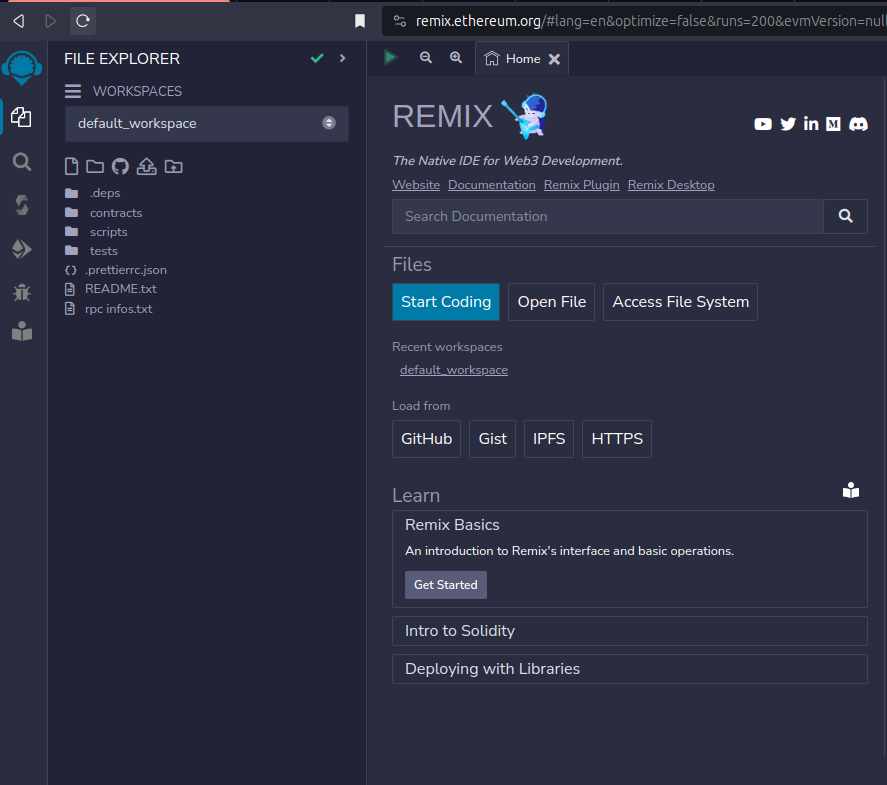
</div>

2. Upload your contracts CampaignCreator.sol and CrowdCollab.sol:
   - Navigate to the contract folder.
   - Click on one contract and press the compile green arrow.

<div style="text-align: center;">
  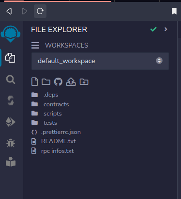
</div>

<div style="text-align: center;">
  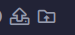
</div>

<div style="text-align: center;">
  
</div>

<div style="text-align: center;">
  
</div>

<div style="text-align: center;">
  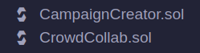
</div>

<div style="text-align: center;">
  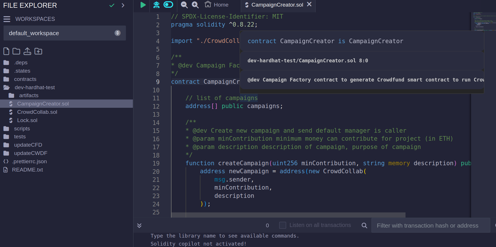
</div>

<div style="text-align: center;">
  
</div>

3. Ensure that the compiler version is set to 0.8.22:
   - Select the "Compiler" tab.
   - Confirm that version 0.8.22 is checked.

<div style="text-align: center;">
  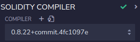
</div>

4. Go to the "Deploy" tab:
   - In the deploy tab, select "Wallet Injected Provider."
   - Connect your MetaMask account to Remix IDE.

<div style="text-align: center;">
  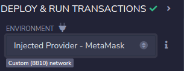
</div>

<em>Depending on your wallet network, poa, hardhat node or sepolia.</em>

<div style="text-align: center;">
  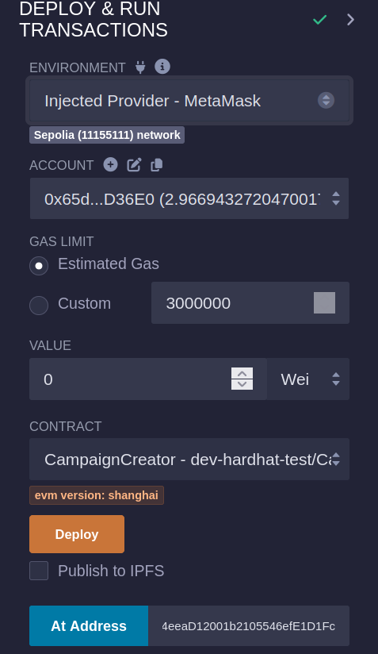
</div>

5. Paste the address of your deployed CampaignCreator.sol contract at the bottom of the deploy tab. (contract need to compiled at that point)

<div style="text-align: center;">
  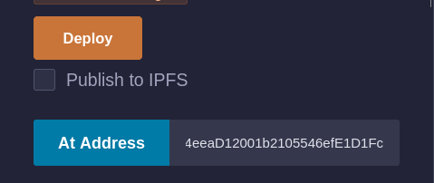
</div>

and click on "address" button

6. Load your already deployed contract:
   - This action allows you to interact with your contract in the newly appeared menu.

<div style="text-align: center;">
  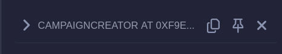
</div>

<div style="text-align: center;">
  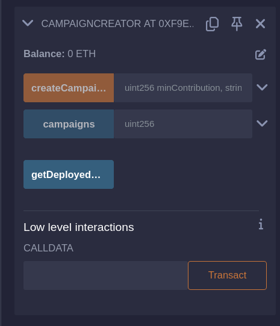
</div>

<div style="text-align: center;">
  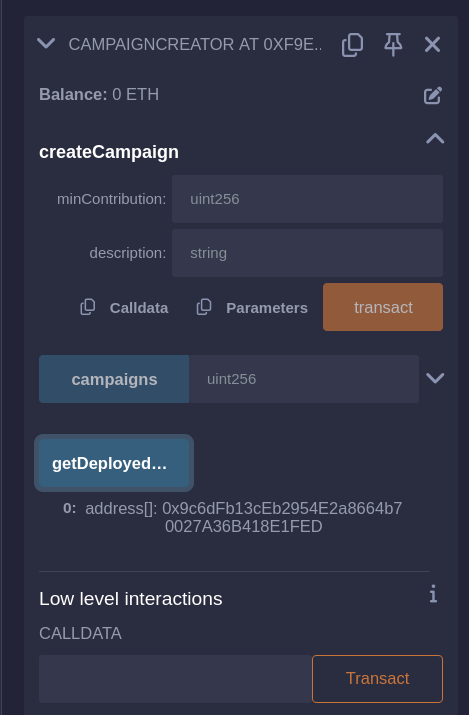
</div>

<div style="text-align: center;">
  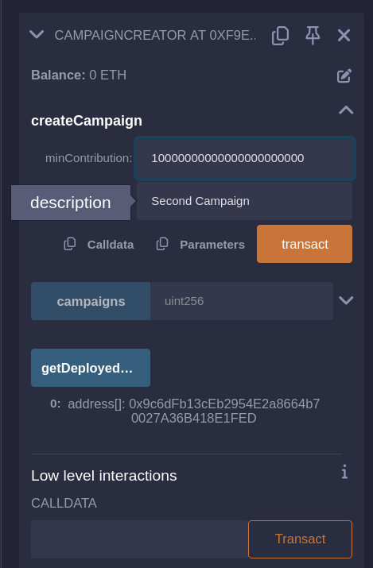
</div>

<div style="text-align: center;">
  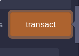
</div>

<div style="text-align: center;">
  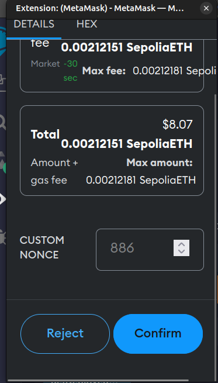
</div>

<div style="text-align: center;">
  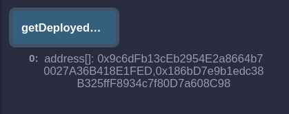
</div>

<div style="text-align: center;">
  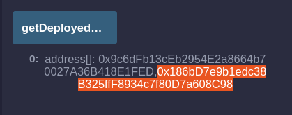
</div>

<div style="text-align: center;">
  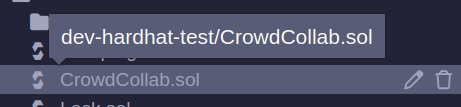
</div>

<div style="text-align: center;">
  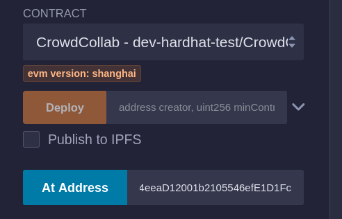
</div>

<div style="text-align: center;">
  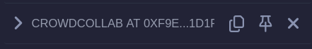
</div>

<div style="text-align: center;">
  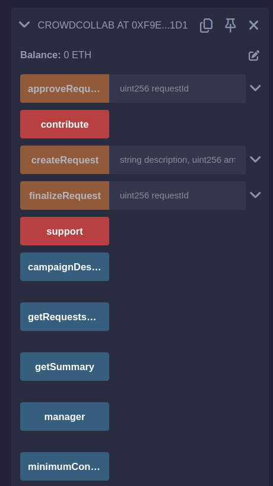
</div>

<div style="text-align: center;">
  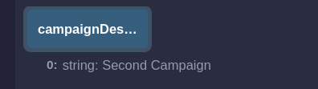
</div>

<div style="text-align: center;">
  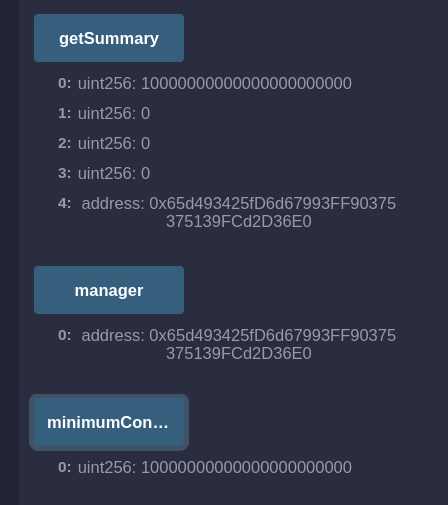
</div>

By adhering to these guidelines, you can efficiently verify and engage with your contracts through Remix IDE before advancing to front-end development.

Once you've established your initial campaign, you may access the CrowdCollab instance address by repeating the earlier procedure, this time selecting the CrowdCollab contract and ensuring it's compiled before invocation.

You can test your contract like this before front-end integration.

---

## front-end integration

### UI-Screenshoots :

**Crowdfund Panel:**

<div style="text-align: center;">
  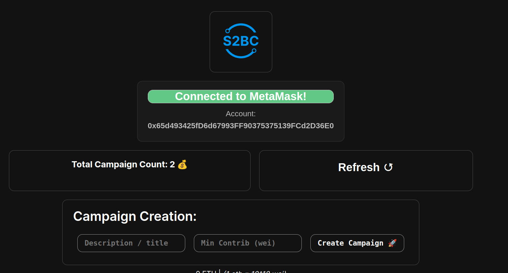
</div>

**Create Panel:**

<div style="text-align: center;">
  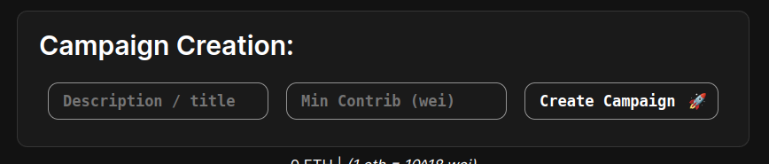
</div>

**Campaign Panel:**

<div style="text-align: center;">
  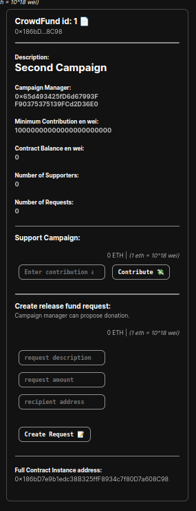
</div>

**Description Section:**

<div style="text-align: center;">
  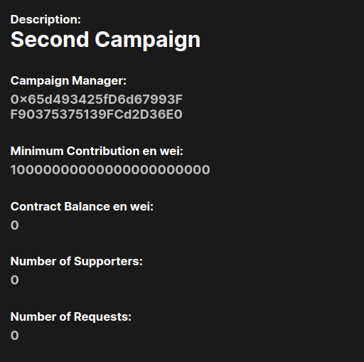
</div>

**Support/Contribute Section:**

<div style="text-align: center;">
  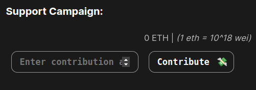
</div>

**Create Request:**

<div style="text-align: center;">
  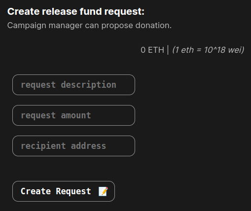
</div>

**Request Description:**

<div style="text-align: center;">
  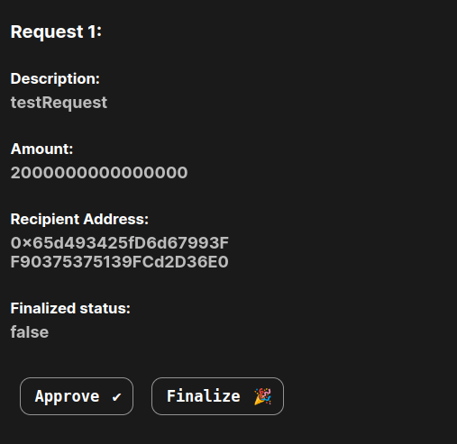
</div>

**Approve:**

<div style="text-align: center;">
  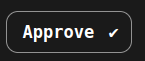
  
</div>

**Finalize:**

<div style="text-align: center;">
  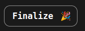
  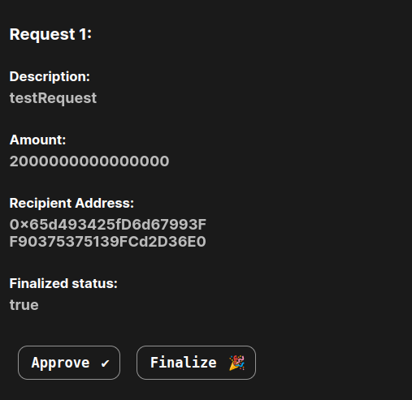
</div>

### Setting Up the Front-end

In this section, we will guide you through setting up the front-end of your Crowdfunding dApp. Follow these steps to create the necessary folders and files:

#### 1. Create a front-end Folder

Begin by creating a folder named `front-end` within your project directory. This folder will house all the files related to the front-end of your dApp.

Your tree folder should be like:

```bash
- crowdfunding-dapp-2024
   - hardhat
   - front-end
```

So if you were in hardhat folder, come back to your root folder:

```bash
cd ..
```

then create the front-end folder

```bash
mkdir front-end
cd front-end
```

#### 2. Let's initiate Nextjs

```bash
npx create-next-app@latest .
```

Choose:

```bash
✔ Would you like to use TypeScript? … No / Yes  (NO)
✔ Would you like to use ESLint? … No / Yes  (NO)
✔ Would you like to use Tailwind CSS? … No / Yes  (NO)
✔ Would you like to use `src/` directory? … No / Yes  (YES)
✔ Would you like to use App Router? (recommended) … No / Yes  (YES)
✔ Would you like to customize the default import alias (@/*)? … No / Yes  (NO)
```

#### 3. **Initialization and Setup dependencies**: The code begins by importing necessary dependencies like Web3, and the contract artifact. It also retrieves the contract address from the `.env.local` file.

```bash
npm install web3 dotenv
```

Check in your root folder package.json, it should look like this:

```json
{
  "name": "front-end",
  "version": "0.1.0",
  "private": true,
  "scripts": {
    "dev": "next dev",
    "build": "next build",
    "start": "next start",
    "lint": "next lint"
  },
  "dependencies": {
    "dotenv": "^16.4.5",
    "next": "14.2.3",
    "react": "^18",
    "react-dom": "^18",
    "web3": "^4.9.0"
  }
}
```

Let's create a ".env.local" file at root of front-end folder where we will put the CampaignCreator contract address:

```bash
nano .env.local
```

Replace by the relevant contract address:

```bash
NEXT_PUBLIC_CONTRACT_ADDRESS='0xf9e783781273b94eeaD12001b2105546efE1D1Fc'
```

Then let's go to /src/app/ folder and edit page.js (our homepage)

First, just delete/clear the whole page, then add this to the top:

```javascript
"use client";

import dotenv from "dotenv";
dotenv.config();

console.log(process.env.NEXT_PUBLIC_CONTRACT_ADDRESS);
```

Then we will import dependencies and call contract addresse variable:

```javascript
import React, { useEffect, useState } from "react";
import Web3 from "web3"; // Import web3 library
import styles from "./page.module.css";
import Image from "next/image";
import campaignCreatorArtifact from "../../../hardhat-deployment/artifacts/contracts/CampaignCreator.sol/CampaignCreator.json"; // Import the JSON file
import CampaignInteraction from "./CampaignInteraction";

const contractAddress = process.env.NEXT_PUBLIC_CONTRACT_ADDRESS;
```

#### 4. **Component State**: The component defines several state variables using the `useState` hook to manage the application's state, including web3 instance, contract instance, campaign count, deployed campaigns, connection status, user address, campaign description, and minimum contribution.

```javascript
export default function Home() {
  const [web3, setWeb3] = useState(null);
  const [contract, setContract] = useState(null);
  const [campaignCount, setCampaignCount] = useState(0);
  const [deployedCampaigns, setDeployedCampaigns] = useState([]);

  const [isConnected, setIsConnected] = useState(false);
  const [userAddress, setUserAddress] = useState("");
  const [description, setDescription] = useState("");
  const [minContribution, setMinContribution] = useState("");
```

#### 5. **Connect to MetaMask**: The `connectMetaMask` function is used to connect to MetaMask and initialize the contract instance. It prompts the user to connect their MetaMask wallet and retrieves their account address.

```javascript
const connectMetaMask = async () => {
  if (window.ethereum) {
    const web3Instance = new Web3(window.ethereum);
    try {
      await window.ethereum.request({ method: "eth_requestAccounts" });
      // Initialize your contract
      const contractABI = campaignCreatorArtifact.abi; // Replace with your contract ABI
      const contractInstance = new web3Instance.eth.Contract(
        contractABI,
        contractAddress
      );
      setWeb3(web3Instance);
      setContract(contractInstance);
      setIsConnected(true);
      const accounts = await web3Instance.eth.getAccounts();
      setUserAddress(accounts[0]);
      console.log("Connected to MetaMask!", accounts[0]);
    } catch (error) {
      console.error("User denied account access or an error occurred:", error);
    }
  } else {
    console.log("MetaMask not found. Please install MetaMask to connect.");
  }
};

// Add this function to handle the connection
const handleConnectButtonClick = () => {
  connectMetaMask();
  setIsConnected(true); // Update isConnected state when connected
};
```

#### 6. **UseEffect Hook**: The `useEffect` hook is utilized to initialize Web3 and fetch campaign count and deployed campaigns when the component mounts.

```javascript
useEffect(() => {
  const initializeWeb3 = async () => {
    try {
      if (window.ethereum) {
        await connectMetaMask();
      } else {
        console.log("MetaMask not found. Please install MetaMask to connect.");
        setIsConnected(false);
      }
    } catch (error) {
      console.error("Error initializing web3:", error);
    }
    const web3Instance = new Web3(window.ethereum);
    setWeb3(web3Instance);
    const accounts = await web3Instance.eth.getAccounts();
    setUserAddress(accounts[0]); // Assuming the first account is the user's address
    setIsConnected(true);
    // getCampaignCount();
  };

  initializeWeb3();
}, []);
```

#### 7. **Interacting with the Contract**: Functions like `getCampaignCount`, `createCampaign`, and `getDeployedCampaigns` interact with the deployed contract to retrieve data and create new campaigns.

```javascript
const getCampaignCount = async () => {
  if (!contract) return;

  try {
    const count = await contract.methods.getDeployedCampaigns().call();
    setCampaignCount(count.length);
    console.log("count", campaignCount);
  } catch (error) {
    console.error("Error fetching campaign count:", error);
  }
};

useEffect(() => {
  if (contract) {
    getCampaignCount();
    getDeployedCampaigns();
  }
}, [contract]);

const createCampaign = async () => {
  if (!contract) return;

  // Check if connected variable is not true, then call connectMetaMask()
  if (!isConnected) {
    connectMetaMask();
    return; // Stop execution until connection is established
  }

  try {
    await contract.methods
      .createCampaign(parseInt(minContribution), description)
      .send({ from: userAddress });
    console.log("Campaign created successfully!");
  } catch (error) {
    console.error("Error creating campaign:", error);
  }
  window.location.reload();
};

const handleDescriptionChange = (event) => {
  setDescription(event.target.value);
};

const handleMinContributionChange = (event) => {
  setMinContribution(event.target.value);
};

// New function to interact with the contract
const getDeployedCampaigns = async () => {
  if (!contract) return;

  try {
    // connectMetaMask();
    const deployedCampaigns = await contract.methods
      .getDeployedCampaigns()
      .call();
    console.log("Deployed Campaigns:", deployedCampaigns);
    setDeployedCampaigns(deployedCampaigns);
  } catch (error) {
    console.error("Error fetching deployed campaigns:", error);
  }
};

// Utility function to truncate Ethereum addresses
const truncateAddress = (address) => {
  const start = address.substring(0, 7);
  const end = address.substring(address.length - 4, address.length);
  return `${start}...${end}`;
};

const handleRefreshButtonClick = () => {
  getDeployedCampaigns();
  window.location.reload(); // Reload the page after fetching deployed campaigns
};

const minContributionETH = minContribution / 10 ** 18;
```

#### 8. **UI Rendering**: The JSX code renders various UI elements like buttons, input fields, and campaign cards to display information and interact with the contract.

```javascript
return (
    <main className={styles.main}>
      {/* Logo */}
      <div className={styles.card} onClick={() => window.location.reload()}>
        <Image
          src="s2bc/s2bc-logo.svg"
          width={96}
          height={96}
          alt="Logo S2BC"
          style={{ textAlign: "center", cursor: "pointer" }} // Add cursor pointer for indicating it's clickable
        />
      </div>

      {/* MetaMask connection button */}
      <button className={styles.card} onClick={handleConnectButtonClick}>
        {!isConnected ? (
          <>
            <h2
              style={{
                background:
                  "rgba(var(--color-connect-button-not-connected), 100)",
                border: "1px solid rgba(var(--card-border-rgb), 100)",
                borderRadius: "12px",
              }}
            >
              Connect MetaMask
            </h2>
            <p>Click here to connect your MetaMask wallet</p>
          </>
        ) : (
          <>
            <h2
              style={{
                background: "rgba(var(--color-connect-button-connected), 100)",
                border: "1px solid rgba(var(--card-border-rgb), 100)",
                borderRadius: "12px",
              }}
            >
              Connected to MetaMask!
            </h2>
            <p>Account:</p>
            <p style={{ wordBreak: "break-all" }}>
              <strong>{userAddress}</strong>
            </p>
          </>
        )}
      </button>

      {/* Grid for campaign-related actions */}
      <div className={styles.grid}>
        {/* Get total campaign count */}
        <div className={styles.card} onClick={getCampaignCount}>
          <h4 style={{ textAlign: "center" }}>
            Total Campaign Count: <strong>{campaignCount}</strong>{" "}
            <span>&#x1F4B0;</span>
          </h4>
        </div>

        {/* Button to refresh deployed campaigns */}
        <button className={styles.card} onClick={handleRefreshButtonClick}>
          <h2>
            Refresh <span>&#x21BA;</span>
          </h2>
        </button>
      </div>

      {/* Form to create a new campaign */}
      <div className={styles.card}>
        <h2>Campaign Creation:</h2>
        <input
          type="text"
          placeholder="Description / title"
          value={description}
          onChange={handleDescriptionChange}
        />
        <input
          type="number"
          placeholder="Min Contrib (wei)"
          value={minContribution}
          onChange={handleMinContributionChange}
        />
        <button onClick={createCampaign}>
          Create Campaign <span>&#x1F680;</span>
        </button>
      </div>

      <p style={{ textAlign: "center", fontSize: "smaller" }}>
        {minContributionETH} ETH | <em>(1 eth = 10^18 wei)</em>
      </p>

      {/* Display deployed campaigns */}
      <div className={styles.grid}>
        {deployedCampaigns.map((campaign, index) => (
          <div className={styles.card} key={index}>
            <h3>
              CrowdFund id: {index + 0} <span>&#x1F4C4;</span>
            </h3>
            <p>{truncateAddress(campaign)}</p>

            <hr />

            {/* Interact with campaign */}
            <CampaignInteraction
              contractAddress={campaign}
              web3={web3}
            />
            <hr />
            <div>
              <h5>Full Contract Instance address:</h5>
              <p style={{ wordBreak: "break-all" }}>{campaign}</p>
            </div>
          </div>
        ))}
      </div>
    </main>
  );
}

```

#### 9. Integrating Campaign Interaction Component

To enhance the functionality of your Crowdfunding dApp front-end, it's essential to integrate the `CampaignInteraction` component. This component facilitates interaction with individual campaigns deployed on the Ethereum blockchain. Here's how you can include it in your application:

1. **Import the Component**: Make sure to import the `CampaignInteraction` component into your main page or any other relevant component where you intend to display campaign details and allow user interaction.

   ```javascript
   import CampaignInteraction from "./CampaignInteraction";
   ```

2. **Render the Component**: It passing necessary props such as `contractAddress`, `web3`, `isConnected`, and `userAddress` to the component.

   ```javascript
   <CampaignInteraction contractAddress={campaignAddress} web3={web3Instance} />
   ```

3. **Utilize Component Features**: Once integrated, the `CampaignInteraction` component enables users to contribute to campaigns, create release fund requests, approve requests, and finalize requests, thereby enhancing the usability and functionality of your Crowdfunding dApp.

---

By integrating the `CampaignInteraction` component, you provide users with a seamless experience to interact with individual campaigns, contributing to the overall success and effectiveness of your Crowdfunding dApp front-end.

CampaignInteraction.js coponent:

```javascript
"use client";

import React, { useEffect, useState } from "react";
import Web3 from "web3";
import crowdCollabArtifact from "../../../hardhat-deployment/artifacts/contracts/CrowdCollab.sol/CrowdCollab.json";
import styles from "./page.module.css";

const contractAbi = crowdCollabArtifact.abi;

const CampaignInteraction = ({ contractAddress, web3 }) => {
  const [contractInstance, setContractInstance] = useState(null);
  const [campaignDescription, setCampaignDescription] = useState("");
  const [manager, setManager] = useState("");
  const [minimumContribution, setMinimumContribution] = useState(0);
  const [minimumContributionShow, setMinimumContributionShow] = useState(0);

  const [numberSupporters, setNumberSupporters] = useState(0);
  const [requests, setRequests] = useState([]);
  const [contributionAmount, setContributionAmount] = useState("");
  const [isConnected, setIsConnected] = useState(false);
  const [userAddress, setUserAddress] = useState("");

  const [requestDescription, setRequestDescription] = useState("");
  const [requestAmount, setRequestAmount] = useState("");
  const [requestRecipient, setRequestRecipient] = useState("");

  const [approvalCounts, setApprovalCounts] = useState([]);
  const [contractBalance, setContractBalance] = useState([]);

  useEffect(() => {
    //const web3 = new Web3("https://votingchain-29886.morpheuslabs.io");
    const instance = new web3.eth.Contract(contractAbi, contractAddress);
    setContractInstance(instance);
  }, [contractAddress]);

  useEffect(() => {
    const getSummary = async () => {
      try {
        if (contractInstance) {
          const description = await contractInstance.methods
            .campaignDescription()
            .call();
          const managerAddress = await contractInstance.methods
            .manager()
            .call();
          const minimumContribution = await contractInstance.methods
            .minimumContribution()
            .call();
          const minimumContributionShow = minimumContribution.toString();

          const numSupporters = await contractInstance.methods
            .numberSupporters()
            .call();

          setCampaignDescription(description);
          setManager(managerAddress);
          setMinimumContribution(minimumContribution);
          setNumberSupporters(numSupporters);

          // Fetch requests
          const requestsCount = await contractInstance.methods
            .getRequestsCount()
            .call();
          const requestsArray = [];
          for (let i = 0; i < requestsCount; i++) {
            const request = await contractInstance.methods.requests(i).call();
            requestsArray.push(request);
          }
          setRequests(requestsArray);

          // Fetch contract balance
          const contractBalance = await web3.eth.getBalance(
            contractInstance.options.address
          );
          setContractBalance(contractBalance);
        }
      } catch (error) {
        console.error("Error getting contract summary:", error);
      }
    };

    getSummary();
  }, [contractInstance]);

  const handleContribution = async () => {
    try {
      if (!window.ethereum) {
        console.error("MetaMask extension not detected");
        return;
      }

      // Request account access if needed
      await window.ethereum.request({ method: "eth_requestAccounts" });

      const web3Instance = new Web3(window.ethereum);
      const accounts = await web3Instance.eth.getAccounts();
      const senderAddress = accounts[0];

      // Initialize contract instance
      const contractInstance = new web3Instance.eth.Contract(
        contractAbi,
        contractAddress
      );

      // Perform the contribution
      await contractInstance.methods.contribute().send({
        value: contributionAmount,
        from: senderAddress,
      });

      // Refresh campaign summary after contribution
      // getSummary();
    } catch (error) {
      console.error("Error contributing to campaign:", error);
    }
    window.location.reload();
  };

  const createRequest = async () => {
    try {
      if (!window.ethereum) {
        console.error("MetaMask extension not detected");
        return;
      }

      await window.ethereum.request({ method: "eth_requestAccounts" });

      const web3Instance = new Web3(window.ethereum);
      const accounts = await web3Instance.eth.getAccounts();
      const senderAddress = accounts[0];

      const contractInstance = new web3Instance.eth.Contract(
        contractAbi,
        contractAddress
      );

      await contractInstance.methods
        .createRequest(requestDescription, requestAmount, requestRecipient)
        .send({ from: senderAddress });
    } catch (error) {
      console.error("Error creating request:", error);
    }
    window.location.reload();
  };

  const approveRequest = async (requestId) => {
    try {
      await window.ethereum.request({ method: "eth_requestAccounts" });
      const web3Instance = new Web3(window.ethereum);
      const accounts = await web3Instance.eth.getAccounts();
      const senderAddress = accounts[0];

      const contractInstance = new web3Instance.eth.Contract(
        contractAbi,
        contractAddress
      );

      await contractInstance.methods.approveRequest(requestId).send({
        from: senderAddress,
      });
    } catch (error) {
      console.error("Error approving request:", error);
    }
    window.location.reload();
  };

  const finalizeRequest = async (requestId) => {
    try {
      await window.ethereum.request({ method: "eth_requestAccounts" });
      const web3Instance = new Web3(window.ethereum);
      const accounts = await web3Instance.eth.getAccounts();
      const senderAddress = accounts[0];

      const contractInstance = new web3Instance.eth.Contract(
        contractAbi,
        contractAddress
      );

      await contractInstance.methods.finalizeRequest(requestId).send({
        from: senderAddress,
      });
    } catch (error) {
      console.error("Error finalizing request:", error);
    }
    window.location.reload();
  };

  const contributionAmountETH = contributionAmount / 10 ** 18;
  const requestAmountETH = requestAmount / 10 ** 18;

  return (
    <div>
      <div>
        <h5>Description:</h5>
        <h2>
          <strong>{campaignDescription}</strong>
        </h2>
      </div>
      <div>
        <h5>Campaign Manager:</h5>
        <p style={{ wordBreak: "break-all" }}>
          <strong>{manager}</strong>
        </p>
      </div>
      <div>
        <h5>Minimum Contribution en wei:</h5>
        <p style={{ wordBreak: "break-all" }}>
          <strong>{minimumContribution.toString()}</strong>
        </p>
      </div>
      <div>
        <h5>Contract Balance en wei:</h5>
        <p style={{ wordBreak: "break-all" }}>
          <strong>{contractBalance.toString()}</strong>
        </p>
      </div>
      <div>
        <h5>Number of Supporters:</h5>
        <p>
          <strong>{numberSupporters.toString()}</strong>
        </p>
      </div>
      <div>
        <h5>Number of Requests:</h5>
        <p>
          <strong>{requests.length}</strong>
        </p>
      </div>
      {/* Render request descriptions */}
      {requests.map((request, index) => (
        <div key={index}>
          <hr />
          <div>
            {/* Request details */}
            <h4>Request {index + 1}:</h4>
          </div>
          <div>
            <h5>Description:</h5>
            <p>
              <strong>{request.description}</strong>
            </p>
          </div>
          <div>
            <h5>Amount:</h5>
            <p>
              <strong>{request.amount.toString()}</strong>
            </p>
          </div>
          <div>
            <h5>Recipient Address:</h5>
            <p>
              <strong>{request.recipient}</strong>
            </p>
          </div>
          <div>
            <h5>Finalized status:</h5>
            <p>
              <strong>{request.complete.toString()}</strong>
            </p>
          </div>

          {/* Button to approve request */}
          <button onClick={() => approveRequest(index)}>
            Approve <span>&#x2714;</span>
          </button>
          {/* Button to finalize request */}
          <button onClick={() => finalizeRequest(index)}>
            Finalize <span>&#x1F389;</span>
          </button>
          {/* Note about request finalization */}
          <div>
            <em style={{ fontSize: "smaller", wordBreak: "keep-all" }}>
              To finalize a request, the number of approvals must exceed half of
              the total supporters.
            </em>
          </div>
        </div>
      ))}

      {/* Input field for contribution amount */}
      <hr />
      <h4>Support Campaign:</h4>
      <div>
        <p style={{ textAlign: "right", fontSize: "smaller" }}>
          {contributionAmountETH} ETH | <em>(1 eth = 10^18 wei)</em>
        </p>
        <input
          type="number"
          value={contributionAmount}
          onChange={(e) => setContributionAmount(e.target.value)}
          placeholder="Enter contribution amount"
        />
        {/* Button to trigger contribution */}
        <button onClick={handleContribution}>
          Contribute <span>&#x1F4B8;</span>
        </button>
      </div>

      {/* Create release fund request section */}

      <hr />

      <h4>Create release fund request:</h4>
      <p style={{ fontSize: "smaller" }}>
        Campaign manager can propose donation.
      </p>
      <div>
        <p style={{ textAlign: "right", fontSize: "smaller" }}>
          {requestAmountETH} ETH | <em>(1 eth = 10^18 wei)</em>
        </p>
      </div>
      <div>
        <input
          type="text"
          value={requestDescription}
          onChange={(e) => setRequestDescription(e.target.value)}
          placeholder="request description"
        />
        <input
          type="number"
          value={requestAmount}
          onChange={(e) => setRequestAmount(e.target.value)}
          placeholder="request amount"
        />

        <input
          type="text"
          value={requestRecipient}
          onChange={(e) => setRequestRecipient(e.target.value)}
          placeholder="recipient address"
        />
      </div>

      {/* Button to create request */}
      <button onClick={createRequest}>
        Create Request <span>&#x1F4DD;</span>
      </button>
    </div>
  );
};

export default CampaignInteraction;
```

### Running the front-end

#### Development Mode

To launch the dapp in development mode, run the following command:

```bash
npm run dev
```

This command starts your application on port 3000. If you're using Morpheus, you can find the address for your node on the dashboard:

Node (port 3000) address:

<div style="text-align: center;">
  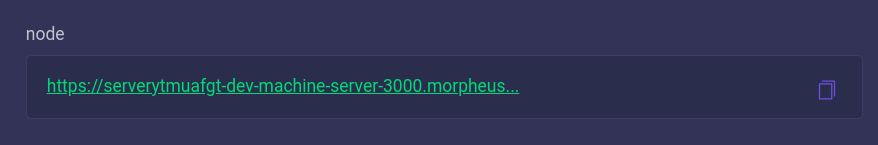
</div>

Here's a screenshot of what the home page might look like:

<div style="text-align: center;">
  
</div>

#### Production Mode

To build the dapp for production, use the following command:

```bash
npm run build
```

Then, start the production server with:

```bash
npm run start
```

This will optimize your application for production and serve it accordingly.
