# Blockchain & Solidity Lab4 – Crowdfunding dApp Development

### S2BC

<div style="text-align: center;">
  
</div>
  
---

### Lab 4: Run a dApp and Consider Next Steps

- BUILD / TEST / INTEGRATE / **RUN**

---

So far, you've followed the steps in Labs 1 to 3, gaining valuable insights into the core components of blockchain development. Now, in Lab 4, we will discuss crucial considerations for running a dApp in Morpheus.

## 1. Running the front-end

Follow these steps to run the front-end of your crowdfunding Dapp:

1. **Start the front-end Server:**

   - Navigate to the `crowd-funding-update-2024/front-end` directory.
   - Run the following command:
     ```bash
     npm run dev
     ```
     This will initiate the server for your Dapp's front-end.

2. **Open the Web App in Morpheus:**

   - In your Morpheus IDE interface, locate the CDE menu in the left menu bar.

   <div style="text-align: center;">
     
   </div>

   - Click on the node service to open your web app.

These steps ensure that your front-end server is up and running, and you can access your crowdfunding Dapp through Morpheus.

## 2. Trying the Crowdfunding Dapp

1. **Connect to Metamask:**

   - Click the connect button. A Metamask popup will appear, asking if you want to connect. Accept using the deployer account.

   <div style="text-align: center;">
       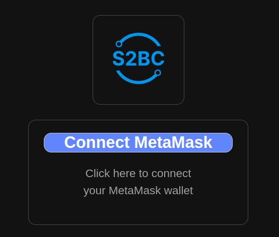
     </div>

     <div style="text-align: center;">
       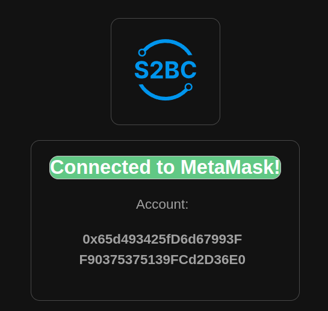
     </div>

2. **Create a campaign:**

   - Create a Campaign on the main dashboard:
     <div style="text-align: center;">
       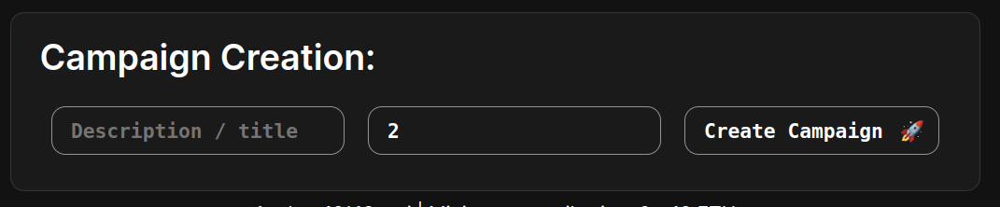
     </div>

3. **Check count caimpaign number:**

   <div style="text-align: center;">
       
     </div>

4. **Refresh if needed:**

   <div style="text-align: center;">
       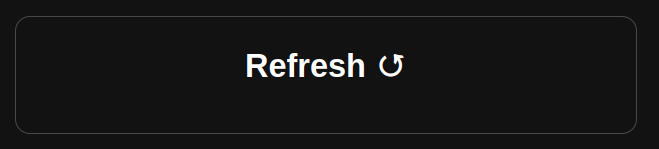
     </div>

   2. **Check the new campaign:**

   - The campaign's dashboard appeared at bottom:
     <div style="text-align: center;">
       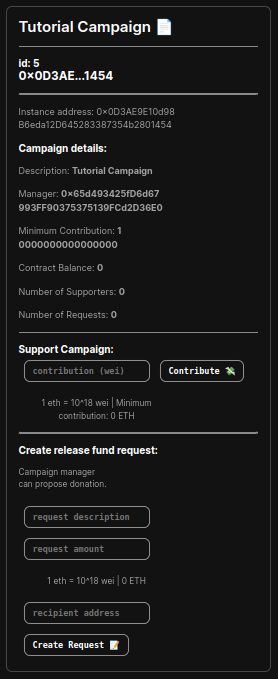
     </div>

5. **Contribute:**

   - Participate in the campaign by contributing. (manager or/and supporter)

   <div style="text-align: center;">
       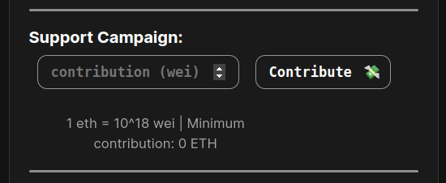
   </div>

6. **Check balance campaign:**

   - Return to the Campaign Panel to view ongoing campaign information.

   <div style="text-align: center;">
       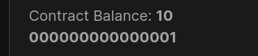
   </div>

7. **Create a request:**

   - Manager can create a request.

   <div style="text-align: center;">
       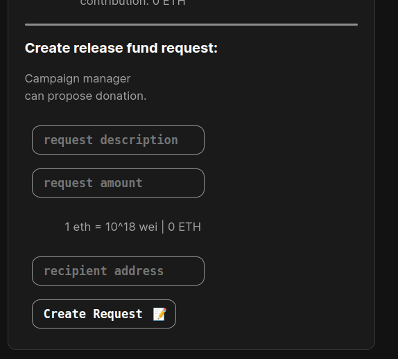
   </div>

8. **Review request:**

   - In Campaign Panel, review requests made by campaign manager.

<div style="text-align: center;">
       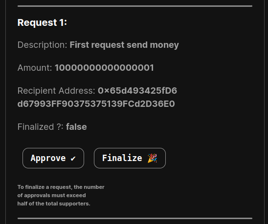
   </div>

9. **Approve request:**

   - In Campaign Panel, approve requests made by campaign manager.

<div style="text-align: center;">
       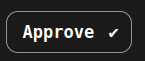
   </div>

10. **Finalize request:**

- Once the campaign is completed, finalize requests to release funds. The funds will be transfered to the recipient address.

<div style="text-align: center;">
       
   </div>
<p>Check the finalized status on the campaign panel:</p>
   <div style="text-align: center;">
       
   </div>

## 3. Migrating to Sepolia Testnet and Utilizing Etherscan

To successfully migrate your dApp to the Sepolia Testnet and leverage Etherscan for enhanced visibility, follow the steps below:

### Step 1: Obtain RPC_URL and Etherscan API Key

1.1 Obtain the RPC_URL for Sepolia from Morpheus, Alkemy's website, or Infura.

1.2 Obtain a free Etherscan API Key from the Etherscan website.

### Step 2: Update Configuration Files

2.1 Open your **.env** file and modify the values as follows:

```env
RPC_URL="https://eth-sepolia.g.alchemy.com/v2/APIKEY"
PRIVATE_KEY="00000...000"
API_KEY="APIKEYFROMETHERSCAN"
```

Ensure the private key corresponds to the deployer account on Sepolia. You can use any account created with Metamask, and acquire testnet ETH from a faucet like Alkemy faucet.

2.2 Update the `chainID` in your `.env` file from 1303 to 11155111, then the PRIVATE_KEY and RPC_URL.

```
# This is the URL of the Ethereum RPC provider
RPC_URL="https://sepoliaacces-20885.morpheuslabs.io/XXXXXXX"

# This is a private key for signing transactions
PRIVATE_KEY="your_private_key_here"

# This is the chain ID for the Sepolia Ethereum network
CHAIN_ID=11155111

# This is the address of a smart contract
CONTRACT_ADDRESS='0x1234567890abcdef'
```

2.3 Then change the network name "poa" to "sepolia" in your `hardhat.config.js`.

```
require("@nomicfoundation/hardhat-toolbox");
require("dotenv").config();

/** @type import('hardhat/config').HardhatUserConfig */
module.exports = {
  solidity: "0.8.22",
  networks: {
    // Add your network configuration here
    sepolia: {
      url: process.env.RPC_URL, // RPC URL of your network
      chainId: parseInt(process.env.CHAIN_ID), // Chain ID of your network
      accounts: [process.env.PRIVATE_KEY], // Array of private keys to use with this network
    },
  },
};
```

---

### Step 3: Redeploy the Contract on Sepolia

3.1 Navigate to the hardhat folder in your terminal.

3.2 Run the following command to redeploy the contract on Sepolia:

```bash
npx hardhat run scripts/deploy.js --network sepolia
```

### Step 4: Update Contract Address in front-end

4.1 Once the deployment is complete, locate the CrampaignCreator contract address.

4.2 Copy the contract address and update the variable in `front-end/public/interact-contract.js` as follows:

```javascript
const contractAddress = "campaignCreatorcontractaddress";
```

### Step 5: Restart the Server

5.1 Start or restart your server using the following command:

```bash
npm run dev
```

### Step 6: Verification on Etherscan

6.1 If you have chosen to verify your contract on Etherscan, you have two methods available:

#### Method 1: Using Hardhat

To verify your contract using Hardhat, follow these steps:

1. Navigate to your Hardhat directory in the terminal.

2. Run the following command, replacing `<campaignCreatorcontractaddress>` with the actual address of your deployed contract:

```bash
npx hardhat verify <campaignCreatorcontractaddress> --network sepolia
```

3. Review the response in the terminal to confirm the success or any output related to the verification process.

4. Check Etherscan to verify if the contract has been successfully verified.

#### Method 2: Using Etherscan Interface

An alternative method is to use the Etherscan interface directly. Provide the following information to Etherscan:

- Contract Code
- Compiler Version
- ABI (Application Binary Interface) of the contract

This method involves interacting with the Etherscan website to manually input the required details for verification.

Choose the method that best fits your workflow or preference. Successful verification ensures transparency and allows users to explore transactions and events within the voting contract on Etherscan, providing detailed insights at each step of the election.

### Step 7: Test the New Setup

7.1 Retry launching a new campaign on this updated setup to ensure seamless functionality.

By following these steps, your dApp should now be successfully migrated to the Sepolia Testnet, utilizing the specified RPC_URL and providing enhanced insights through Etherscan verification.

Explore the following Etherscan screenshots for a visual confirmation:

https://sepolia.etherscan.io/

<div style="text-align: center;">
  
</div>

<div style="text-align: center;">
  
</div>

<div style="text-align: center;">
  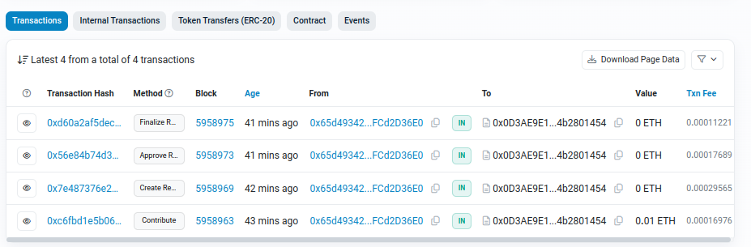
</div>

<div style="text-align: center;">
  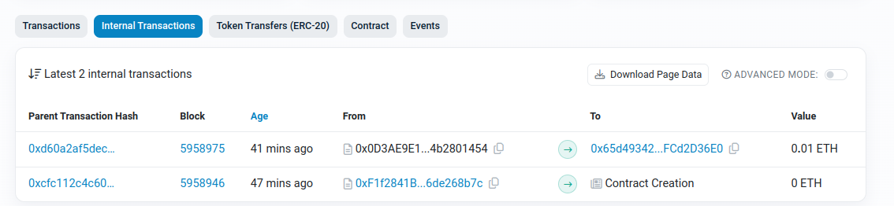
</div>

<div style="text-align: center;">
  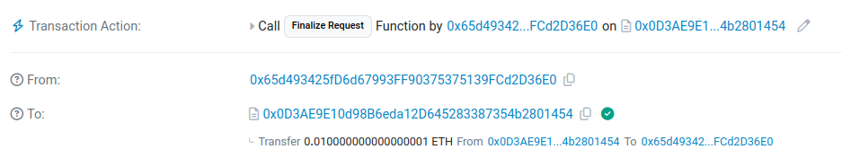
</div>

---

## 4. Uploading Your dApp on Morpheus app library to share with community

For detailed steps on uploading your dApp, refer to the [documentation](https://docs.morpheuslabs.io/docs/submit-app-to-the-app-store).

## https://docs.morpheuslabs.io/docs/submit-app-to-the-app-store

<div style="text-align: center;">
  
</div>
